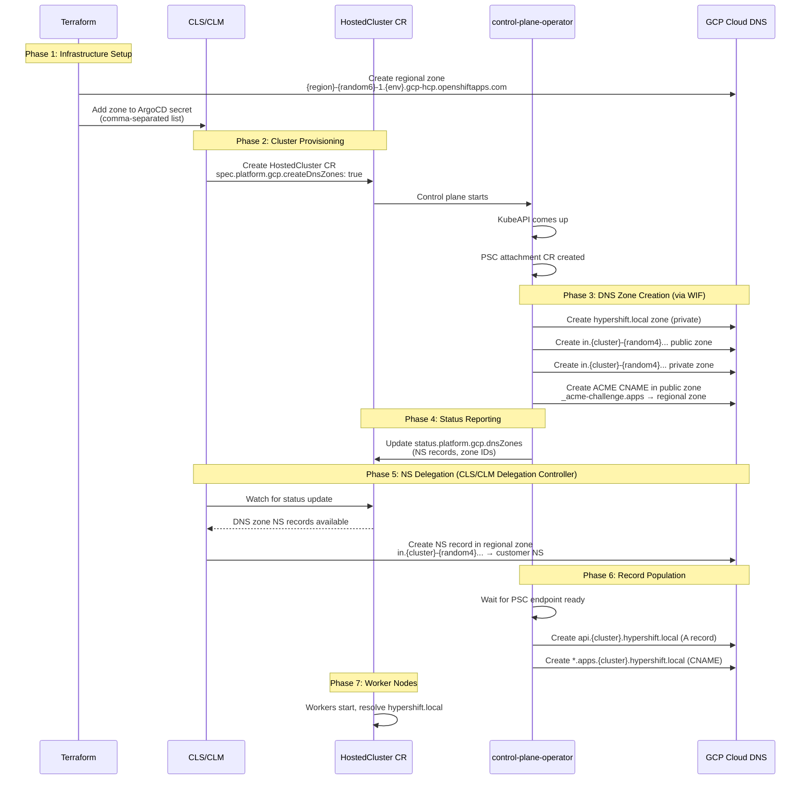

# Customer DNS Zone Management via control-plane-operator

**Scope**: GCP-HCP

**Date**: 2025-11-19

## Decision

Customer DNS zones (`in.{cluster}-{random4}...` public/private and `{cluster}.hypershift.local`) will be created by the **control-plane-operator** running in the hosted control plane namespace on the management cluster, using Workload Identity Federation for authentication. NS delegation records in the regional zone will be created by a **CLS/CLM controller** after detecting zone creation via HostedCluster status updates.

## Context

### Problem Statement

GCP HCP requires DNS infrastructure to support hosted clusters, including:
- Customer-side DNS zones for ingress (`in.{cluster}-{random4}.{region}-{random6}-1.{env}.gcp-hcp.openshiftapps.com`)
- Private internal zone (`{cluster}.hypershift.local`)
- NS delegation from Red Hat regional zones to customer zones
- ACME challenge delegation for Let's Encrypt certificate validation

The fundamental question is: **which component should create customer DNS zones and manage the delegation flow?**

### Constraints

1. **Security**: Minimize blast radius of compromised credentials
2. **Authentication**: Use Workload Identity Federation (WIF) - no long-lived service account keys
3. **Compatibility**: Align with existing Hypershift patterns where possible
4. **Scalability**: Support multiple hosted clusters per region
5. **Regional Zones**: Pre-created by Terraform (`{region}-{random6}-1.{env}.gcp-hcp.openshiftapps.com`)

### Assumptions

- Token minter sidecar pattern is established (see `gcp-hcp/experiments/wif-example`)
- control-plane-operator can obtain GCP credentials scoped to customer project
- HostedCluster status can propagate zone metadata to management cluster
- KubeAPI must be running before zone creation (unlike AWS/Azure patterns)

## Alternatives Considered

### 1. **CLS/CLM Creates Zones (ROSA Pattern)**

**Description**: Clusters Service (CLS) or Cluster Lifecycle Manager (CLM) creates all customer DNS zones during cluster provisioning, before HostedCluster CR is created.

**Pros**:
- Mirrors existing ROSA architecture
- Well-understood pattern
- Zones ready before control plane starts

**Cons**:
- ❌ CLS/CLM requires credentials for ALL customer projects
- ❌ Single point of failure - compromise exposes all customers
- ❌ Violates least privilege principle
- ❌ Requires CLS to maintain GCP service account mappings per customer

### 2. **Infrastructure CLI Creates Zones (Hypershift Pattern)**

**Description**: `hypershift create infra gcp` CLI command creates zones before HostedCluster creation, similar to AWS/Azure implementations.

**Pros**:
- Consistent with AWS/Azure patterns
- Zones available before control plane starts
- CLI runs in customer context

**Cons**:
- ❌ Requires customer to run CLI (not suitable for managed service)
- ❌ Not compatible with CLS-driven provisioning
- ❌ Customer must pre-configure credentials

### 3. **control-plane-operator Creates Zones (Chosen)**

**Description**: control-plane-operator running in the hosted control plane namespace creates customer DNS zones after KubeAPI is available, using token minter sidecar for WIF authentication. A separate CLS/CLM controller handles NS delegation after detecting zone creation.

**Pros**:
- ✅ Scoped credentials: each control-plane-operator only accesses its customer project
- ✅ No credentials in central services (CLS/CLM)
- ✅ WIF authentication eliminates long-lived keys
- ✅ Natural lifecycle: zones created/deleted with cluster
- ✅ Reduced attack surface

**Cons**:
- ⚠️ Requires KubeAPI to be running first
- ⚠️ New code in control-plane-operator
- ⚠️ Slightly more complex than ROSA pattern

## Decision Rationale

### Justification

We chose **Alternative 3 (control-plane-operator)** because it provides the strongest security posture while maintaining operational feasibility:

1. **Least Privilege**: Each control-plane-operator instance has credentials scoped to exactly one customer project with `roles/dns.admin`. A compromised operator cannot access other customers.

2. **No Central Credential Store**: CLS/CLM does not need GCP credentials for customer projects, eliminating a high-value attack target.

3. **Workload Identity Federation**: Token minter pattern (proven in `gcp-hcp/experiments/wif-example`) provides short-lived tokens with automatic rotation. No service account keys are stored anywhere.

4. **Security Isolation**: Follows the principle of "complete mediation" - each access request (per cluster) uses independent, scoped credentials.

5. **Operational Feasibility**: Post-KubeAPI zone creation is acceptable because:
   - `hypershift.local` zone only needed after worker nodes start
   - KAS certificate is self-signed (not ACME-based), so zone not required for cert issuance
   - Public ingress ACME challenges use delegation pattern (see below)

### Evidence

- **Existing WIF Implementation**: Token minter pattern validated in `gcp-hcp/experiments/wif-example/README.md`
- **IAM Bindings**: Reference implementation in [hypershift PR #7231](https://github.com/openshift/hypershift/pull/7231/files) (`iam-bindings.json`)
- **GCP Best Practices**: WIF is Google's recommended authentication method (no service account keys)

### Comparison

| Aspect | CLS Creates (Alt 1) | Infra CLI (Alt 2) | control-plane-operator (Alt 3) |
|--------|---------------------|-------------------|-------------------------------|
| Security isolation | ❌ Central credentials | ✅ Customer context | ✅ Per-cluster scope |
| Attack surface | ❌ High (all customers) | ✅ Low | ✅ Minimal |
| Managed service fit | ✅ Yes | ❌ No (requires CLI) | ✅ Yes |
| ROSA compatibility | ✅ Identical | ❌ Different | ⚠️ Similar flow |
| Implementation complexity | ✅ Simple | ✅ Simple | ⚠️ Moderate |

**Why Alternative 1 was rejected**: Security risk of centralized credentials outweighs operational simplicity. A compromise of CLS/CLM credentials would expose ALL customer projects.

**Why Alternative 2 was rejected**: Incompatible with managed service model where CLS orchestrates cluster creation.

## Consequences

### Positive

1. **Enhanced Security Posture**: Each hosted cluster operates with isolated, scoped credentials. Lateral movement between customer projects is impossible.

2. **No Long-Lived Credentials**: WIF token exchange eliminates service account key storage. All tokens are short-lived and automatically rotated by token minter.

3. **Simplified CLS/CLM**: Regional services only need access to Red Hat regional zones (for NS delegation), not customer projects.

4. **Natural Lifecycle Management**: DNS zones are created/deleted with cluster. No orphaned zones if cluster deletion fails.

5. **Compliance Friendly**: Clear audit trail - each zone operation traceable to specific hosted cluster operator pod.

6. **Future-Proof**: Pattern extends naturally to other customer project operations (e.g., PSC endpoint management, GCE instance operations).

### Negative

1. **Timing Dependency**: KubeAPI must be running before zones are created. If KubeAPI fails, zones are never created (but this is acceptable - no point in zones without control plane).

2. **New Code Path**: Requires implementing DNS zone management in control-plane-operator. Increases code complexity compared to ROSA where CLS handles this.

3. **Debugging Complexity**: Zone creation issues require inspecting control-plane-operator logs in hosted control plane namespace, rather than centralized CLS logs.

4. **Sequencing Requirements**: Multiple dependent steps create potential for transient failures:
   - KubeAPI up → zones created → NS records reported → delegation created → records populated

5. **Failure Recovery**: If zone creation fails, cluster won't fully come up (workers can't resolve `hypershift.local`). Requires retry logic and clear status reporting.

6. **External-DNS Integration**: Requires verification that external-dns-operator (if used) can access regional zones. Investigation still needed (see below).

## Cross-Cutting Concerns

### Reliability

#### Scalability
- **Regional Zone Limits**: Using `-1` suffix pattern (`{region}-{random6}-1.{env}.gcp-hcp.openshiftapps.com`) enables future expansion to `-2`, `-3`, etc. if GCP DNS zone limits are reached
- **Zone Selection**: For now, single zone (`-1`) provided via comma-separated list in ArgoCD secret. Future expansion: fill `-1` before creating `-2`
- **Terraform Automation**: New regional zones created via `gcp-hcp-infra` Terraform. GitOps pattern makes scaling relatively straightforward

#### Observability
- **HostedCluster Status**: DNS zone metadata (NS records, zone IDs) surfaced in `status.platform.gcp.dnsZones` (exact format TBD during implementation)
- **Status Conditions**: Separate conditions for each phase:
  - `DNSZonesCreated`: Zones exist in customer project
  - `DNSDelegationReady`: NS records created in regional zone
  - `HypershiftLocalRecordsReady`: PSC endpoint records created
- **Logging**: control-plane-operator logs DNS operations with zone names, NS records, errors
- **CLS/CLM Monitoring**: Controller watches for status updates and logs delegation operations

#### Resiliency
- **Failure Modes**:
  - **Zone creation fails**: control-plane-operator retries with exponential backoff. HostedCluster status shows `DNSZonesCreated=False` with error message
  - **IAM permissions denied**: Clear error in control-plane-operator logs. Customer must grant `roles/dns.admin` to WIF service account
  - **NS delegation fails**: CLS/CLM controller retries. Cluster functional but ingress unreachable until resolved
  - **PSC endpoint delay**: Records in `hypershift.local` created only after PSC ready. Workers wait until DNS resolves
- **Rollback**: If cluster creation fails, control-plane-operator cleanup deletes customer DNS zones
- **Idempotency**: All zone/record operations are idempotent (GCP Cloud DNS API guarantees this)

### Security

1. **Workload Identity Federation**: All GCP API calls use short-lived tokens obtained via token minter sidecar. No service account keys stored in Kubernetes secrets.

2. **IAM Roles**: control-plane-operator service account has `roles/dns.admin` in customer project only (not project-wide admin). Reference: `iam-bindings.json` in [hypershift PR #7231](https://github.com/openshift/hypershift/pull/7231/files).

3. **Token Isolation**: Tokens never leave the control-plane-operator pod. Shared volume pattern (see `gcp-hcp/experiments/wif-example/README.md`) ensures tokens accessible only to sidecar and main container.

4. **Least Privilege**: CLS/CLM controllers have write access only to Red Hat regional zones (for NS delegation). No access to customer projects.

5. **Credential Scope**: Each hosted cluster has independent WIF configuration. Credentials cannot be reused across clusters.

6. **Audit Trail**: All GCP Cloud DNS operations logged in GCP Cloud Audit Logs with principal identity (WIF service account) and source (control-plane-operator pod).

### Performance

- **Zone Creation Latency**: GCP Cloud DNS zones create in ~30-60 seconds. Adds to overall cluster provisioning time but acceptable (clusters take minutes to provision).

- **Token Exchange Overhead**: WIF token exchange adds ~200-500ms per API call. Token minter caches tokens for 3600s, so minimal impact.

- **NS Propagation**: DNS delegation propagates globally in 1-5 minutes. Not a blocker for cluster provisioning (workers can start without it).

- **Parallel Operations**: Zone creation (control-plane-operator) and NS delegation (CLS/CLM) can proceed in parallel after status update. No sequential blocking.

### Cost

- **DNS Zone Costs**: GCP charges ~$0.20/month per zone. Customer pays for 3 zones per cluster (`hypershift.local`, public, private). Negligible compared to compute costs.

- **DNS Query Costs**: First 1 billion queries/month free, then $0.40 per million. Expected cost: < $1/month per cluster.

- **No Additional Infrastructure**: No new GCP projects or service accounts required (uses existing customer project).

### Operability

#### Deployment Complexity
- **Token Minter Sidecar**: Added to control-plane-operator deployment. Configuration via HostedCluster CR (`spec.platform.gcp.createDnsZones: true`).

- **CLS/CLM Controller**: New controller deployed in management cluster region namespace. Watches HostedCluster resources for status changes.

- **Terraform Changes**: Minimal - only adding regional zone to ArgoCD secret/configmap as comma-separated list.

#### Maintenance Burden
- **Code Ownership**: control-plane-operator DNS logic owned by Hypershift team. CLS/CLM delegation controller owned by CLS team.

- **Debugging**: Operators must inspect multiple locations:
  - control-plane-operator logs (zone creation)
  - CLS/CLM logs (delegation)
  - GCP Cloud DNS console (zone/record state)

- **Testing**: Requires integration tests covering full sequence (zone creation → status update → delegation → record population).

#### Configuration Management
- **Regional Zone List**: Provided to CLS via ArgoCD secret in region cluster. Format: `us-central1-abc123-1.prd.gcp-hcp.openshiftapps.com` (comma-separated, single zone for now).

- **HostedCluster CR**: New field `spec.platform.gcp.createDnsZones: true` triggers zone creation. Future: could be granular (`createPublicDnsZone`, `createPrivateDnsZone`).

---

## Implementation Details

### DNS Hierarchy

```
openshiftapps.com
└── gcp-hcp.openshiftapps.com (commons zone, NS via app-interface)
    └── {env}.gcp-hcp.openshiftapps.com (environment zone, Terraform global project)
        └── {region}-{random6}-1.{env}.gcp-hcp.openshiftapps.com (regional zone, Terraform regional project)
            ├── api.{cluster}-{random4}.{region}-{random6}-1.{env}.gcp-hcp.openshiftapps.com (A → KAS LB)
            ├── oauth.{cluster}-{random4}.{region}-{random6}-1.{env}.gcp-hcp.openshiftapps.com (A → KAS LB) [FUTURE]
            ├── _acme-challenge.{cluster}-{random4}... (TXT → cert-manager)
            └── in.{cluster}-{random4}.{region}-{random6}-1.{env}.gcp-hcp.openshiftapps.com (NS → customer zone)
                └── *.apps.in.{cluster}-{random4}... (customer zone, ingress operator)
```

**Character Count Update**: Adding `-1` suffix adds 2 characters. Worst-case FQDN: ~145 characters (well under 253 RFC limit). ✅

### Sequencing Flow



### Record Creation Responsibilities

| Record | Zone | Created By | Timing |
|--------|------|------------|--------|
| `api.{cluster}-{random4}...` | Regional | **TBD**: external-dns-operator (investigation needed) | After KubeAPI up |
| `oauth.{cluster}-{random4}...` | Regional | **FUTURE**: Not enabled initially | N/A |
| `_acme-challenge.{cluster}-{random4}...` | Regional | cert-manager (on MC) | During cert issuance |
| `in.{cluster}-{random4}...` NS | Regional | CLS/CLM delegation controller | After status update |
| `_acme-challenge.apps...` CNAME | Customer public | control-plane-operator | Upon zone creation |
| `*.apps.in.{cluster}-{random4}...` | Customer public/private | Ingress operator (on workers) | After workers up |
| `api.{cluster}.hypershift.local` | hypershift.local | control-plane-operator | After PSC endpoint ready |
| `*.apps.{cluster}.hypershift.local` | hypershift.local | control-plane-operator | After PSC endpoint ready |

**Note**: External-DNS operator integration requires verification. See reference to `setupExternalDNS` in `hypershift/cmd/install/install.go`.

### Authentication Flow (Token Minter Pattern)

```
control-plane-operator pod
├── token-minter sidecar
│   ├── Connects to hosted cluster API (via kubeconfig)
│   ├── Requests service account token (TokenRequest API)
│   ├── Token signed by hosted cluster SA signing key
│   ├── Writes token to /var/run/secrets/openshift/serviceaccount/token
│   └── Refreshes before expiration (automatic rotation)
│
└── control-plane-operator container
    ├── Reads token from shared volume
    ├── Uses GCP external account credentials (WIF config)
    ├── Exchanges token with GCP STS (WIF provider validates JWKS)
    ├── Receives OAuth 2.0 access token for GCP service account
    └── Calls GCP Cloud DNS API (with roles/dns.admin)
```

**Details**: See `gcp-hcp/experiments/wif-example/README.md` for complete implementation.

**IAM Configuration**: Reference `iam-bindings.json` in [hypershift PR #7231](https://github.com/openshift/hypershift/pull/7231/files).

---

## Open Questions / Future Work

1. **External-DNS Operator Integration** ⚠️
   - **Question**: Does external-dns-operator run on MC and create `api.{cluster}-{random4}...` records?
   - **Action**: Investigate `setupExternalDNS` in `hypershift/cmd/install/install.go`
   - **Fallback**: If not available, CLS/CLM controller must create API records

2. **OAuth Records** ⚠️
   - **Question**: Are OAuth endpoints needed for GCP HCP?
   - **Status**: Not enabled initially. Mention in design but defer implementation.

3. **Private Cluster Public Zone** ⚠️
   - **Question**: Should private-only clusters skip public zone creation?
   - **Decision**: Create public zone for ALL clusters (needed for ACME challenge delegation)
   - **Future**: Could add `spec.platform.gcp.createPublicDnsZone: false` for fully private clusters

4. **Zone Scaling** ⚠️
   - **Question**: When/how to create `-2`, `-3`, etc. zones?
   - **Decision**: Deferred to future when scaling challenges emerge
   - **Pattern**: Fill `-1` before starting `-2`. GitOps automation makes this straightforward.

5. **HostedCluster Status Schema** ⚠️
   - **Question**: Exact structure for `status.platform.gcp.dnsZones`?
   - **Decision**: TBD during implementation (not Condition, but dedicated status field)

---

## References

- **Jira Ticket**: GCP-206
- **WIF Implementation**: `gcp-hcp/experiments/wif-example/README.md`
- **IAM Bindings**: [Hypershift PR #7231](https://github.com/openshift/hypershift/pull/7231/files)
- **Template**: [Design Decision Template](TEMPLATE.md)

---

## Validation Checklist

- [x] Title is descriptive and action-oriented
- [x] Scope is GCP-HCP
- [x] Date is present and in ISO format (YYYY-MM-DD)
- [x] All core sections are present
- [x] Both positive and negative consequences are listed
- [x] Decision statement is clear and unambiguous
- [x] Problem statement articulates the "why"
- [x] Constraints and assumptions are explicitly documented
- [x] Rationale includes justification, evidence, and comparison
- [x] Consequences are specific and actionable
- [x] Trade-offs are honestly assessed
- [x] Cross-cutting concerns have concrete details
- [x] Security implications are thoroughly considered
- [x] Cost impact is evaluated
- [x] Document provides sufficient detail for future reference
- [x] Links to related documentation are included
