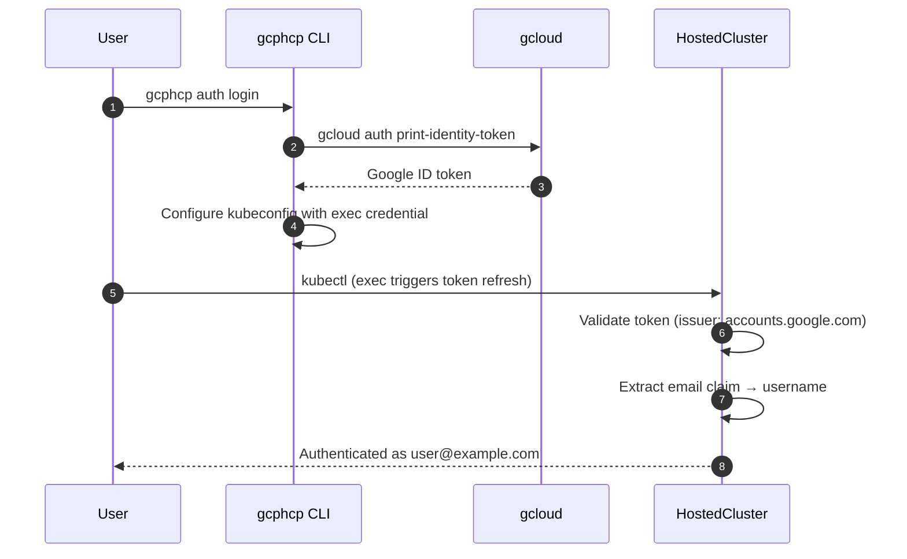

# Phase 1: Direct Google OIDC Authentication

This folder contains the initial pilot approach for authenticating to GCP HCP HostedClusters using Google OIDC directly.

## Overview

In this approach, the HostedCluster is configured to trust Google's OIDC provider (`accounts.google.com`) directly. Users authenticate using their Google identity tokens obtained via `gcloud auth print-identity-token`.

## Architecture



### Component Flow

```
┌─────────────┐     ┌─────────────────────────────┐     ┌─────────────────┐
│   kubectl   │────▶│  bash -c "gcloud auth       │────▶│ HostedCluster   │
└─────────────┘     │  print-identity-token"      │     │ API Server      │
                    └─────────────────────────────┘     └─────────────────┘
                              │                                 │
                              ▼                                 ▼
                    ┌──────────────────┐          ┌──────────────────────┐
                    │ Google OAuth     │          │ OIDC Validation via  │
                    │ (user creds)     │          │ accounts.google.com  │
                    └──────────────────┘          │ public JWKS          │
                                                  └──────────────────────┘
```

## How It Works

1. User runs `gcphcp auth login` which wraps `gcloud auth print-identity-token`
2. The CLI configures kubeconfig with an exec-based credential plugin
3. On each kubectl command, the exec plugin fetches a fresh identity token
4. HostedCluster validates the JWT signature using Google's public JWKS
5. API server extracts claims (email, hd) for user identity and group membership
6. Kubernetes RBAC determines authorization based on user/groups

## Kubeconfig Structure

The CLI configures kubeconfig with an exec-based credential plugin that fetches fresh tokens on each request:

```yaml
users:
- name: my-cluster
  user:
    exec:
      apiVersion: client.authentication.k8s.io/v1beta1
      command: bash
      args:
      - -c
      - |
        cat <<EOT
        {
          "apiVersion": "client.authentication.k8s.io/v1beta1",
          "kind": "ExecCredential",
          "status": {
            "token": "$(gcloud auth print-identity-token)"
          }
        }
        EOT
```

## Token Format

The identity token is a JWT containing user claims:

```
eyJhbGciOiJSUzI1NiIsInR5cCI6IkpXVCJ9.eyJpc3MiOi...
```

Decoded payload:
```json
{
  "iss": "https://accounts.google.com",
  "email": "user@redhat.com",
  "hd": "redhat.com",
  "sub": "1234567890",
  "exp": 1704825600
}
```

| Claim | Usage |
|-------|-------|
| `email` | Mapped to Kubernetes username |
| `hd` | Hosted domain, mapped to Kubernetes group |
| `iss` | Issuer, validated against configured OIDC provider |

## Configuration

The HostedCluster is configured with Google as an OIDC provider:

```yaml
authentication:
  type: OIDC
  oidcProviders:
    - name: google
      issuer:
        issuerURL: https://accounts.google.com
        audiences:
          - "32555940559.apps.googleusercontent.com"  # gcloud CLI client ID
      claimMappings:
        username:
          claim: email
        groups:
          # Google Workspace domain → Kubernetes group
          claim: hd
          prefix: ""
```

## RBAC Setup

Once users authenticate via Google OIDC, authorization is handled via Kubernetes RBAC. The `hd` (hosted domain) claim is mapped to Kubernetes groups, enabling domain-based access control.

### ClusterRoleBinding Example

The following ClusterRoleBinding grants `cluster-admin` access to:
- All users from a specific Google Workspace domain (e.g., `redhat.com`)
- The specific user who created the cluster

```yaml
apiVersion: rbac.authorization.k8s.io/v1
kind: ClusterRoleBinding
metadata:
  name: redhat-domain-admins
roleRef:
  apiGroup: rbac.authorization.k8s.io
  kind: ClusterRole
  name: cluster-admin
subjects:
  # Grant access to all users in the redhat.com domain
  - apiGroup: rbac.authorization.k8s.io
    kind: Group
    name: redhat.com
  # Grant access to the cluster creator
  - apiGroup: rbac.authorization.k8s.io
    kind: User
    name: user@example.com
```

### How Domain-Based RBAC Works

1. User authenticates with Google identity token
2. Token contains `hd` claim (e.g., `redhat.com` for `user@redhat.com`)
3. HostedCluster maps `hd` claim to Kubernetes group
4. ClusterRoleBinding grants permissions based on group membership

> **Note:** The CLS controller automatically creates this RBAC setup as a Job when the cluster is provisioned.

## Usage

### Option 1: Using gcphcp CLI (Recommended)

```bash
# Login and configure kubeconfig (wraps gcloud auth print-identity-token)
gcphcp auth login

# The kubeconfig is configured with exec-based auth
# Tokens are automatically refreshed on each kubectl command
kubectl get namespaces
```

### Option 2: Manual Token

```bash
# Get Google identity token directly
GOOGLE_TOKEN=$(gcloud auth print-identity-token)

# Authenticate to cluster
kubectl --server="https://api.<cluster>.<domain>:443" \
  --token="$GOOGLE_TOKEN" \
  get namespaces
```

## Limitations

| Limitation | Description |
|------------|-------------|
| **Limited group mapping** | Uses `hd` (hosted domain) claim for groups, not fine-grained groups |
| **No IAM integration** | GCP IAM roles are not considered for authorization |

## Files

| File | Description |
|------|-------------|
| `hostedcluster-pub-oidc.yaml` | HostedCluster with direct Google OIDC |
| `README.md` | This documentation |

## Related

- [GKE Auth Comparison](../gke-auth-comparison.md) - How this approach compares to GKE's auth plugin
- [Phase 2: Identity Platform OIDC](../phase2-poc/identity-platform-oidc.md) - Enhanced approach with IAM-based access control

