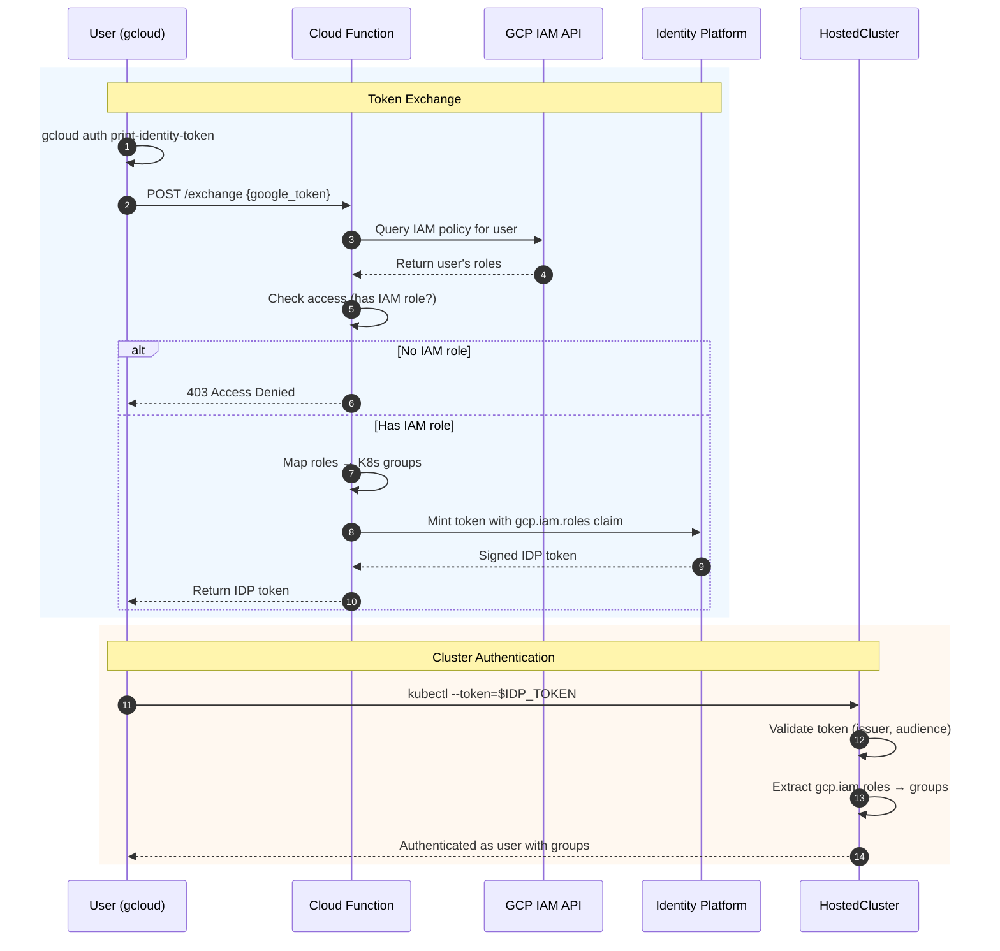

# Identity Platform OIDC Authentication for GCP HCP

This document describes the Identity Platform OIDC authentication approach for GCP Hosted Control Planes (HCP). This approach enables users to authenticate to OpenShift clusters using their Google Cloud identity with automatic IAM role-based access control.

## Overview

Traditional OIDC authentication with Google (`accounts.google.com`) allows any Google user to authenticate. This approach uses **Google Identity Platform** as an intermediary to:

1. **Restrict access** to users with IAM roles on the GCP project
2. **Map IAM roles** to Kubernetes groups automatically
3. **Mint custom tokens** with role-based claims

## Architecture



See [Cloud Function README](cloud-function/README.md) for detailed implementation.

## Components

### 1. Google Identity Platform

Identity Platform is Google Cloud's customer identity and access management (CIAM) platform. It provides:

- Custom token minting with arbitrary claims
- OIDC-compliant tokens (`securetoken.google.com/<project-id>`)
- Integration with Firebase Admin SDK

**Issuer URL:** `https://securetoken.google.com/<project-id>`

### 2. Cloud Function (Token Exchange)

A serverless function that:

1. Validates incoming Google identity tokens
2. Queries IAM policies to find user's roles
3. Maps IAM roles to Kubernetes groups
4. Mints Identity Platform tokens with custom claims

**Endpoint:** `POST /exchange`

**IAM Role Mapping:**

| GCP IAM Role | Kubernetes Group |
|--------------|------------------|
| `roles/owner` | `cluster-admin` |
| `roles/editor` | `cluster-admin` |
| `roles/viewer` | `cluster-viewer` |
| `roles/container.admin` | `cluster-admin` |
| `roles/container.viewer` | `cluster-viewer` |

### 3. HostedCluster OIDC Configuration

The HostedCluster is configured to trust Identity Platform as an OIDC provider:

```yaml
authentication:
  type: OIDC
  oidcProviders:
    - name: gcp-identity-platform
      issuer:
        issuerURL: https://securetoken.google.com/<project-id>
        audiences:
          - "<project-id>"
      claimMappings:
        username:
          claim: email
        groups:
          claim: gcp.iam.roles
```

### 4. RBAC ClusterRoleBinding

Map the Kubernetes groups to ClusterRoles:

```yaml
apiVersion: rbac.authorization.k8s.io/v1
kind: ClusterRoleBinding
metadata:
  name: idp-cluster-admins
roleRef:
  apiGroup: rbac.authorization.k8s.io
  kind: ClusterRole
  name: cluster-admin
subjects:
  - kind: Group
    name: cluster-admin
    apiGroup: rbac.authorization.k8s.io
```

## Token Claims

### Google Identity Token (Input)

```json
{
  "iss": "https://accounts.google.com",
  "aud": "32555940559.apps.googleusercontent.com",
  "email": "user@example.com",
  "exp": 1766086626
}
```

### Identity Platform Token (Output)

```json
{
  "iss": "https://securetoken.google.com/<YOUR-PROJECT-ID>",
  "aud": "<YOUR-PROJECT-ID>",
  "sub": "ewRcd48EQdOr1ZLkLPIvSESnv8Q2",
  "email": "user@example.com",
  "email_verified": true,
  "gcp.iam.roles": ["cluster-admin"],
  "gcp.project": "<YOUR-PROJECT-ID>",
  "iat": 1766086576,
  "exp": 1766090176
}
```

**Key custom claims:**
- `gcp.iam.roles`: Kubernetes groups mapped from IAM roles
- `gcp.project`: GCP project ID for context

## Usage

### Step 1: Get Google Identity Token

```bash
GCLOUD_TOKEN=$(gcloud auth print-identity-token)
```

### Step 2: Exchange for IDP Token

```bash
CLOUD_FUNCTION_URL="https://<YOUR-CLOUD-FUNCTION>.run.app"

IDP_TOKEN=$(curl -s -X POST "${CLOUD_FUNCTION_URL}/exchange" \
  -H "Authorization: Bearer $GCLOUD_TOKEN" \
  -H "Content-Type: application/json" \
  -d "{\"google_token\": \"$GCLOUD_TOKEN\"}" | jq -r '.idp_token')
```

### Step 3: Authenticate to Cluster

```bash
kubectl --server="https://api.<cluster>.<domain>:443" \
  --token="$IDP_TOKEN" \
  get namespaces
```

### One-liner

```bash
kubectl --token=$(curl -s -X POST "https://<YOUR-CLOUD-FUNCTION>.run.app/exchange" \
  -H "Authorization: Bearer $(gcloud auth print-identity-token)" \
  -H "Content-Type: application/json" \
  -d "{\"google_token\": \"$(gcloud auth print-identity-token)\"}" | jq -r '.idp_token') \
  get namespaces
```

## Setup Guide

### Prerequisites

- GCP Project
- `gcloud` CLI authenticated with project access
- IAM permissions to enable APIs and create resources

### 1. Setup Identity Platform

Run the setup script to enable APIs and configure the OIDC provider:

```bash
./setup-identity-platform.sh <project-id>
```

This script:
- Enables Identity Platform and Cloud Functions APIs
- Configures OIDC provider to accept gcloud tokens
- Creates/retrieves API key for Cloud Function

### 2. Deploy Cloud Function

```bash
cd cloud-function
./deploy.sh <project-id>
```

See [cloud-function/README.md](cloud-function/README.md) for details.

### 3. Configure HostedCluster

Apply the HostedCluster YAML with Identity Platform OIDC configuration:

```bash
kubectl apply -f hostedcluster-idp-oidc.yaml
```

### 4. Create RBAC Bindings

```bash
kubectl create clusterrolebinding idp-cluster-admins \
  --clusterrole=cluster-admin \
  --group=cluster-admin
```

## Security Considerations

### Access Control

- **Project-level access**: Only users with IAM roles on the project can authenticate
- **Role-based permissions**: Kubernetes permissions are derived from IAM roles
- **No anonymous access**: Token exchange requires valid Google identity

### Token Security

- **Short-lived tokens**: IDP tokens expire after 1 hour
- **Signed tokens**: Tokens are signed by Google's Identity Platform keys
- **Audience validation**: Tokens are scoped to specific project

### Cloud Function Security

- **Authenticated access**: Cloud Function requires Google identity token
- **Service account**: Runs with minimal required IAM permissions
- **No stored credentials**: All authentication is token-based

## Comparison with Direct Google OIDC

| Aspect | Direct Google OIDC | Identity Platform OIDC |
|--------|-------------------|------------------------|
| Access Control | Any Google user | Only users with project IAM roles |
| Group Mapping | Manual or none | Automatic from IAM roles |
| Custom Claims | Not possible | Fully customizable |
| Token Issuer | accounts.google.com | securetoken.google.com |
| Setup Complexity | Simple | Moderate |

## Limitations

| Limitation | Description |
|------------|-------------|
| **Cloud Function dependency** | Requires Cloud Function in customer project, adding maintenance and update responsibilities |
| **Extra network hop** | Token exchange requires call to Cloud Function before cluster access |
| **Role changes not immediate** | IAM role changes require GCP propagation + new token to take effect |


## Next Steps

| Item | Description |
|------|-------------|
| **Explore scoped token minting alternatives** | Investigate options beyond Cloud Function for scoped token generation and their deployment models (e.g., managed backend service, CLI-side, sidecar) |
| **Refine RBAC mapping strategy** | Evaluate mapping GCP permissions vs roles to Kubernetes RBAC; permissions offer finer granularity but increase complexity |

## Files

| File | Description |
|------|-------------|
| `hostedcluster-idp-oidc.yaml` | HostedCluster with IDP OIDC config |
| `cloud-function/main.py` | Token exchange Cloud Function |
| `demo-oidc-flow.sh` | Demo script for the auth flow |
| `idp-oidc-demo.cast` | Asciinema recording |
| `idp-oidc-demo.gif` | Animated GIF demo |

## References

- [Google Identity Platform Documentation](https://cloud.google.com/identity-platform/docs)
- [OpenShift OIDC Authentication](https://docs.openshift.com/container-platform/latest/authentication/identity_providers/configuring-oidc-identity-provider.html)
- [Firebase Admin SDK - Custom Claims](https://firebase.google.com/docs/auth/admin/custom-claims)

