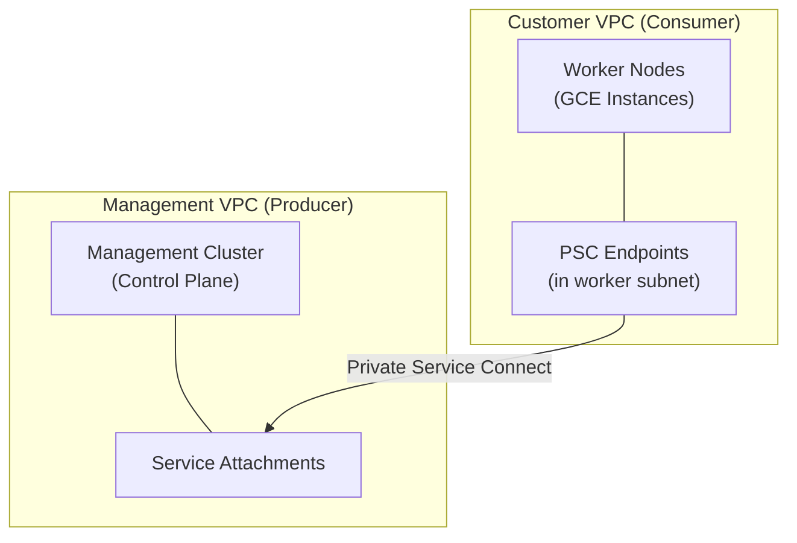
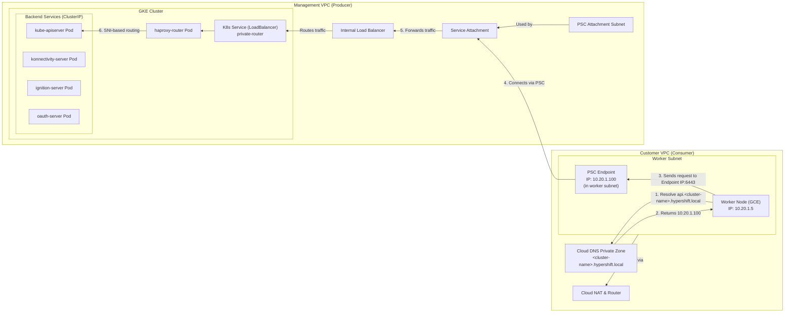
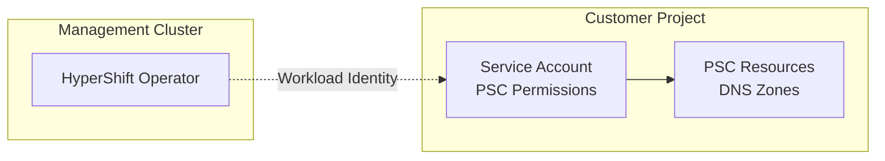

# Private Service Connect Implementation Plan for HyperShift

## Overview

This document outlines the plan to implement **Private Service Connect (PSC)** for production-ready network isolation between HyperShift management clusters and worker nodes, replacing the current single-VPC architecture with separate management and workload VPCs.



### Detailed PSC Connection Flow



## Network Design

### Management VPC Configuration
```yaml
name: hypershift-management-vpc
subnets:
  - name: psc-attachment-subnet
    purpose: PRIVATE_SERVICE_CONNECT
    note: "Mandatory NAT subnet required by the PSC Service Attachment itself. Created during Management Cluster setup."
```

### Customer VPC Configuration
```yaml
name: hypershift-customer-vpc
subnets:
  - name: workers-subnet
    purpose: OpenShift worker nodes (GCE instances) AND PSC endpoint
    note: "Hosts both worker nodes and PSC endpoint in simplified architecture"
```

### Private Router

By leveraging a haproxy-based router model, we can consolidate the four required Hypershift services behind a single Private Service Connect endpoint on GCP.

* Single Endpoint with SNI Router: The architecture introduces a dedicated private-router deployment within the management cluster that uses SNI-based routing for all guest cluster traffic.

    1. A single GCP Internal Load Balancer (ILB) is created, listening on TCP port 443.
    2. The ILB is configured with a health check to monitor the health of the router pods.
    3. The ILB forwards all traffic to the private-router service backend.
    4. The private-router inspects the Server Name Indication (SNI) header on the incoming TLS connection without terminating the TLS session (TLS Passthrough).
    5. Based on the SNI hostname, it proxies the connection to the appropriate backend service:
        * api.<cluster-name>.hypershift.local → kube-apiserver:6443
        * ignition-server.apps.<cluster-name>.hypershift.local → ignition-server-proxy:443
        * oauth-openshift.apps.<cluster-name>.hypershift.local → oauth-openshift:6443
        * konnectivity-server.apps.<cluster-name>.hypershift.local → konnectivity-server:8091
        * **URL-less traffic (no SNI) → kube-apiserver:6443 (default fallback)**
    6. All backend services (kube-apiserver, etc.) are configured as standard ClusterIP services, as they are no longer directly exposed.
    7. This single ILB is published via a single Service Attachment, allowing the customer VPC to connect to all services through a single PSC Endpoint.

This approach is functionally equivalent to the AWS architecture, where a single NLB with multiple listeners serves multiple backend services.

### Service Attachment Allocation Strategy

```bash
# Each hosted cluster gets a dedicated Service Attachment
Hosted Cluster A: psc-service-attachment-cluster-a → Projects: [customer-a-project]
Hosted Cluster B: psc-service-attachment-cluster-b → Projects: [customer-b-project]

# Each Service Attachment publishes its hosted cluster's dedicated Internal Load Balancer
cluster-a-private-router-ilb ← psc-service-attachment-cluster-a
cluster-b-private-router-ilb ← psc-service-attachment-cluster-b
```

## Infrastructure Responsibility Model

### Infrastructure Managed by Red Hat

Red Hat's management infrastructure creates and manages the following PSC components:

- **Multiple PSC Attachment Subnets** (one per hosted cluster) in the management VPC
- **Multiple PSC Service Attachments** (one per hosted cluster) that each publish their respective hosted cluster's Internal Load Balancer
- **Hosted-cluster-specific PSC Endpoints** in customer VPCs that connect to the respective Service Attachments
- **Per-hosted-cluster access control** via Service Attachment consumer accept lists (restricts each Service Attachment to specific customer project IDs, ensuring tenant isolation)
- **DNS records** for the hypershift.local domain within a pre-existing private DNS zone.
- **Individual Internal Load Balancers** (one per hosted cluster) forwarding traffic to each private-router service
- **Service discovery and routing** via the private-router SNI proxy (automatically created by HyperShift operator)


**Note**: Each hosted cluster gets a **dedicated Service Attachment** with **project-level access restrictions**, providing network-level hosted cluster identification without requiring customer-managed PSC NAT subnets.

### Infrastructure Managed by the Customer

Customers must provision their networking infrastructure:

- **Dedicated VPC** for their workload infrastructure
- **Worker Subnet**: For GCE instances that become OpenShift worker nodes **AND** PSC endpoint hosting
- **Cloud Router and NAT** for outbound internet access
- **Basic firewall rules** for egress traffic and administrative access

## Service Mapping for PSC

### Services Requiring PSC Exposure

| **Service** | **Previous Type** | **PSC Implementation** | **SNI Hostname** | **Backend Port** | **Purpose** |
|-------------|------------------|----------------------|------------------|------------------|-------------|
| **kube-apiserver** | LoadBalancer | ClusterIP via SNI | `api.*.hypershift.local` | 6443 | Worker registration & API calls |
| **ignition-server-proxy** | NodePort | ClusterIP via SNI | `ignition-server.apps.*.hypershift.local` | 443 | Worker bootstrap configuration |
| **konnectivity-server** | LoadBalancer | ClusterIP via SNI | `konnectivity-server.apps.*.hypershift.local` | 8091 | Control plane → worker tunnel |
| **oauth-openshift** | NodePort | ClusterIP via SNI | `oauth-openshift.apps.*.hypershift.local` | 6443 | Authentication flows |

**Note**: All services are accessed through a single PSC endpoint (port 443) using SNI-based routing. The private-router inspects the TLS SNI header to route to the appropriate backend service.

### DNS Resolution Strategy

To align with the established security and isolation model in the HyperShift source code, a **dedicated Cloud DNS Private Zone must be created for each hosted cluster**. This zone must be associated *only* with that specific customer's workload VPC to provide a strong DNS isolation boundary between tenants. The HyperShift operator is only responsible for managing the DNS *records* within this pre-existing zone.

The zone will be named based on the cluster, for example: `<cluster-name>.hypershift.local.`.

```yaml
# Cloud DNS Private Zone Configuration (for Customer A's '<cluster-name>' cluster)
zone_name: hypershift-<cluster-name>-private-zone
dns_name: <cluster-name>.hypershift.local. # Unique per cluster
networks:
  - hypershift-workload-pc-customer-a # Attached ONLY to this customer's VPC
visibility: private

# DNS Records within the dedicated zone for '<cluster-name>'
records:
  # All records point to the SAME IP of the single PSC endpoint
  - name: api.<cluster-name>.hypershift.local.
    type: A
    ttl: 300
    rrdatas: ["10.20.11.5"] # Single PSC endpoint IP
  - name: "*.apps.<cluster-name>.hypershift.local."
    type: A
    ttl: 300
    rrdatas: ["10.20.11.5"] # Wildcard for all app services
  # Specific app service examples (covered by wildcard)
  - name: ignition-server.apps.<cluster-name>.hypershift.local.
    type: A
    ttl: 300
    rrdatas: ["10.20.11.5"] # Worker bootstrap configuration
  - name: konnectivity-server.apps.<cluster-name>.hypershift.local.
    type: A
    ttl: 300
    rrdatas: ["10.20.11.5"] # Control plane tunnel
  - name: oauth-openshift.apps.<cluster-name>.hypershift.local.
    type: A
    ttl: 300
    rrdatas: ["10.20.11.5"] # Authentication flows
```

---

### Production Scale Assessment

#### Resource & Cost Scaling

This section outlines the division of costs between the customer's GCP project and the provider's (Red Hat's) GCP project.

**Customer Project Costs (Per Hosted Cluster)**
*These resources are provisioned in the customer's GCP project and are billed directly to the customer.*
```yaml
  PSC Endpoint: 1 × ~$18.25 = ~$18.25/month  # Forwarding rule in customer VPC
  Data Processing: ~$0.01/GB                # Billed to consumer for traffic sent to producer
  Private DNS Zone: ~$0.50/month
  ----------------------------------------------------
  Total (Variable): ~$18.75/month + data processing fees
```

**Provider Project Costs (Per Hosted Cluster)**
*These resources are provisioned in the provider's management project.*
```yaml
  # Note: Prices are on-demand estimates for us-central1 and can vary.
  Service Attachment / ILB: 1 × ~$18.25 = ~$18.25/month
  private-router deployment: (amortized cost, negligible per-cluster)
  Backend Services & Firewall Rules: $0 (configuration only)
  ----------------------------------------------------
  Total (Estimated): ~$18.25/month per hosted cluster

  # Note: The GKE management cluster fee (~$73/month) and its node costs
  # are separate and amortized across all hosted clusters it manages.
```

## Security Considerations

### Network Isolation
- Complete separation of management and workload traffic
- No direct network connectivity between VPCs except via PSC
- Private connectivity without internet exposure for control plane services

### Access Control
- PSC connection policies restrict which projects can consume services
- Service-level access controls via Kubernetes RBAC

### Compliance Benefits
- Meets requirements for network segmentation in regulated environments
- Supports multi-tenant architectures with workload isolation
- Enables audit logging of cross-VPC service access
- Reduces compliance scope by isolating management infrastructure
- Simplified architecture reduces attack surface and infrastructure complexity

### Security Model Validation

```bash
# Each hosted cluster gets dedicated Service Attachment with project restrictions
gcloud compute service-attachments create psc-service-attachment-cluster-a \
    --region=us-central1 \
    --producer-forwarding-rule=cluster-a-private-router-ilb \
    --consumer-accept-lists=customer-a-project-id \
    --nat-subnets=psc-attachment-subnet

gcloud compute service-attachments create psc-service-attachment-cluster-b \
    --region=us-central1 \
    --producer-forwarding-rule=cluster-b-private-router-ilb \
    --consumer-accept-lists=customer-b-project-id \
    --nat-subnets=psc-attachment-subnet

```

#### Hosted Cluster Isolation Testing
```bash
# Test 1: Verify Customer A cannot connect to Hosted Cluster B's Service Attachment
customer_a_project$ gcloud compute forwarding-rules create test-endpoint \
    --target-service-attachment=projects/management-project/regions/us-central1/serviceAttachments/psc-service-attachment-cluster-b
# Expected: Access denied (project not in consumer accept list)

# Test 2: Verify management cluster logs show correct Service Attachment usage
management_cluster$ gcloud logging read 'resource.type="private_service_connect_endpoint"'
# Expected: Clear identification of which Service Attachment was used

# Test 3: Verify project-level access control
gcloud compute service-attachments describe psc-service-attachment-cluster-a
# Expected: consumer-accept-lists contains only Customer A's project ID

```

#### Audit Trail Verification
```bash
# Verify each hosted cluster's connections are identifiable via Service Attachment logs
gcloud logging read 'resource.type="private_service_connect_endpoint" AND
    jsonPayload.service_attachment_name="psc-service-attachment-cluster-a"'
# Expected: All connections for Hosted Cluster A via their dedicated Service Attachment

gcloud logging read 'resource.type="private_service_connect_endpoint" AND
    jsonPayload.service_attachment_name="psc-service-attachment-cluster-b"'
# Expected: All connections for Hosted Cluster B via their dedicated Service Attachment

# Application-level audit trail (hosted cluster identification via TLS certificates and SNI)
management_cluster$ kubectl logs -n clusters-cluster-a kube-apiserver | grep "user"
# Expected: Hosted Cluster A's cluster-specific certificate authentication

```

## Cross-Project Authentication and Permissions

### Overview

PSC implementation requires the HyperShift operator to create resources in customer GCP projects:
- PSC Endpoints (forwarding rules and IP reservations)
- DNS Records (in private DNS zones)
- Network validation and configuration

### Authentication Approach

We use **Workload Identity Federation** following GCP security best practices:



### Customer Requirements

**Customer Setup:**
- Create service account with PSC and DNS permissions
- Configure Workload Identity Federation
- Provide authentication details in HostedCluster configuration

**HostedCluster Configuration:**
```yaml
spec:
  platform:
    gcp:
      rolesRef:
        pscServiceAccount:
          serviceAccountEmail: hypershift-psc-operator@customer-project.iam.gserviceaccount.com
          workloadIdentityPool: hypershift-pool
          workloadIdentityProvider: hypershift-provider
```

**Required Permissions (for the Operator's Service Account):**
- compute.addresses.* (PSC endpoint IPs)
- compute.forwardingRules.* (PSC forwarding rules)
- dns.managedZones.get (To find the pre-existing zone)
- dns.managedZones.list (To find the pre-existing zone)
- dns.resourceRecordSets.* (To manage DNS records within the zone)

## Implementation Blocks

### Prerequisites
*These foundational steps must be completed before PSC implementation.*

#### 1. Management Cluster Setup
*These tasks are performed once to prepare the management environment.*
- [ ] **Management VPC Infrastructure**:
    - [ ] Create management VPC with appropriate CIDR ranges
    - [ ] Create a pool of PSC attachment subnets with PURPOSE=PRIVATE_SERVICE_CONNECT
- [ ] **GKE Management Cluster**:
    - [ ] Deploy GKE management cluster
    - [ ] Install and configure HyperShift operator
    - [ ] Verify HyperShift operator is running and ready

#### 2. Hosted Cluster Deployment
*These tasks are performed to deploy a hosted cluster.*
- [ ] **Customer Project Setup**:
    - [ ] Validate customer has provided worker subnet information (name, VPC, region)
    - [ ] Confirm customer VPC allows PSC endpoint creation in worker subnet
    - [ ] Validate customer worker subnet has sufficient IP address space for PSC endpoint
    - [ ] Verify customer project networking prerequisites are met
- [ ] **Hosted Cluster Deployment**:
    - [ ] Deploy hosted cluster, platform GCP, and ensure it is stable
    - [ ] Control Plane Operator deploys the private-router service (type: LoadBalancer)
    - [ ] Wait for private-router service to be fully deployed and stable
- [ ] **Internal Load Balancer Discovery**:
    - [ ] Wait for LoadBalancer service to automatically create dedicated Internal Load Balancer
    - [ ] Locate the automatically-created Internal Load Balancer forwarding rule name
    - [ ] Verify ILB is healthy and accepting traffic

#### 3. Cross-Project Authentication Setup
*These tasks establish secure authentication for cross-project PSC resource management.*

- [ ] **Customer Authentication Configuration**:
  - [ ] Customer creates service account in their project with required PSC and DNS permissions
  - [ ] Customer configures Workload Identity Federation (workload identity pool and OIDC provider)
  - [ ] Customer binds HyperShift operator service account to customer service account via workload identity
  - [ ] Customer provides authentication details in HostedCluster rolesRef configuration

- [ ] **Authentication Validation**:
  - [ ] Validate HostedCluster rolesRef configuration contains all required authentication fields
  - [ ] Test HyperShift operator can successfully authenticate to customer project
  - [ ] Verify operator has required permissions for PSC endpoint and DNS operations
  - [ ] Validate cross-project network access and subnet discovery functionality

### Core PSC Implementation
*This is the main focus of this document - creating PSC infrastructure.*

#### 4. PSC Infrastructure Creation
*These tasks are performed for each new hosted cluster, creating hosted-cluster-specific PSC infrastructure.*

- [ ] **Pre-Creation Validation**:
    - [ ] Query customer worker subnet to get actual CIDR range
    - [ ] Validate worker subnet exists and is accessible
    - [ ] Verify management cluster Internal Load Balancer is ready

- [ ] **PSC Service Attachment Creation**:
    - [ ] Create hosted-cluster-specific Service Attachment with unique name: `psc-service-attachment-{hosted-cluster-name}`
    - [ ] Configure Service Attachment to point to the hosted cluster's dedicated Internal Load Balancer
    - [ ] Set NAT subnets neverto use the dedicated PSC attachment subnet
    - [ ] Set consumer accept list to restrict access to customer's project ID only
    - [ ] Verify Service Attachment is active and linked to ILB

- [ ] **Customer PSC Endpoint Creation**:
    - [ ] Create static IP address reservation in customer worker subnet
    - [ ] Create PSC forwarding rule pointing to management Service Attachment
    - [ ] Configure forwarding rule with proper network and target
    - [ ] Verify endpoint IP allocation and basic connectivity
    - [ ] Verify PSC endpoint has valid IP and forwarding rule

- [ ] **DNS Infrastructure Setup**:
    - [ ] **Verify** that the pre-existing hosted-cluster-specific DNS zone (`{hosted-cluster-name}.hypershift.local`) is correctly configured and associated with the customer VPC.
    - [ ] Start DNS transaction for safe record creation
    - [ ] Create multiple DNS records pointing to PSC endpoint IP:
        - [ ] API server: `api.{hosted-cluster-name}.hypershift.local`
        - [ ] Wildcard apps: `*.apps.{hosted-cluster-name}.hypershift.local`
        - [ ] Specific services: ignition-server, konnectivity-server, oauth-openshift
    - [ ] Execute DNS transaction atomically
    - [ ] Verify DNS propagation and resolution from customer VPC

- [ ] **Component Status Verification**:
    - [ ] Verify PSC attachment subnet is created and configured
    - [ ] Verify Service Attachment is active and linked to ILB
    - [ ] Verify PSC endpoint has valid IP and forwarding rule
    - [ ] Verify DNS zone and all records are created correctly

- [ ] **Connectivity and Validation Testing**:
    - [ ] Test PSC endpoint IP resolution from customer VPC
    - [ ] Test DNS resolution for all service endpoints from customer VPC
    - [ ] Validate SNI routing through private-router for each service:
        - [ ] Test API server connectivity (api.{cluster-name}.hypershift.local:6443)
        - [ ] Test ignition-server connectivity (ignition-server.apps.{cluster-name}.hypershift.local:443)
        - [ ] Test konnectivity-server connectivity (konnectivity-server.apps.{cluster-name}.hypershift.local:8091)
        - [ ] Test oauth-openshift connectivity (oauth-openshift.apps.{cluster-name}.hypershift.local:6443)
    - [ ] Verify SSL/TLS certificate validation works end-to-end
    - [ ] Perform end-to-end worker node bootstrap test

- [ ] **Access Control and Security Validation**:
    - [ ] Verify Service Attachment consumer accept list restricts access correctly
    - [ ] Test that other projects cannot access the Service Attachment
    - [ ] Verify firewall rules block unauthorized traffic sources
    - [ ] Validate hosted cluster isolation (cannot access other hosted clusters' Service Attachments)

- [ ] **Documentation and Handoff**:
    - [ ] Generate PSC infrastructure summary with all component details
    - [ ] Provide connection test commands for troubleshooting
    - [ ] Document access points and IP addresses for operations team
    - [ ] Create operational runbook for PSC infrastructure management
