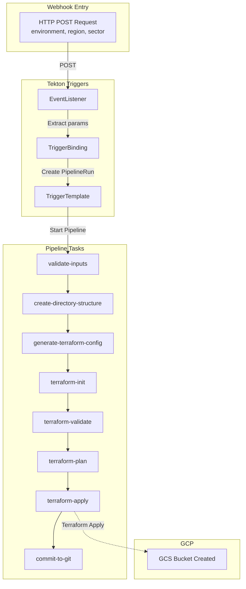

# GCP Region Provisioning Pipeline

This directory contains Tekton configurations for a webhook-triggered pipeline that automates the provisioning of Google Cloud Platform resources using Terraform.

## Quick Start

```bash
# 1. Set up GCP authentication (one-time setup)
cd setup
./setup-local-gcp-auth.sh
./grant-storage-admin.sh

# 2. Apply all Tekton resources
kubectl apply -f pvc.yaml
kubectl apply -f sa.yaml
kubectl apply -f k8s/serviceaccount.yaml
kubectl apply -f k8s/terraform-gcp-task.yaml
kubectl apply -f pipeline.yaml
kubectl apply -f triggerbinding.yaml
kubectl apply -f triggertemplate.yaml
kubectl apply -f eventlistener.yaml

# 3. Test the pipeline
curl -X POST http://localhost:8080 \
  -H "Content-Type: application/json" \
  -d '{"environment": "integration", "region": "us-central1", "sector": "test"}'
```

## Architecture

### Pipeline Flow



### Components

**Triggers:**
- **[eventlistener.yaml](eventlistener.yaml)** - Webhook endpoint (exposed on port 8080)
- **[triggerbinding.yaml](triggerbinding.yaml)** - Extracts parameters from webhook payload
- **[triggertemplate.yaml](triggertemplate.yaml)** - Creates PipelineRun instances

**Pipeline:**
- **[pipeline.yaml](pipeline.yaml)** - Main pipeline with 8 tasks
- **[k8s/terraform-gcp-task.yaml](k8s/terraform-gcp-task.yaml)** - Reusable Terraform task with GCP auth

**Authentication:**
- **[k8s/serviceaccount.yaml](k8s/serviceaccount.yaml)** - GCP workload identity service account
- **[sa.yaml](sa.yaml)** - Tekton triggers RBAC

**Storage:**
- **[pvc.yaml](pvc.yaml)** - Persistent workspace for sharing files between tasks

## What the Pipeline Does

1. **validate-inputs** - Validates environment, region, and sector parameters
2. **create-directory-structure** - Creates directory: `config/region/{env}/{sector}/{region}/`
3. **generate-terraform-config** - Generates `main.tf` with GCS bucket resource
4. **terraform-init** - Initializes Terraform with GCP provider
5. **terraform-validate** - Validates Terraform configuration
6. **terraform-plan** - Plans infrastructure changes
7. **terraform-apply** - Applies changes (creates GCS bucket in GCP)
8. **commit-to-git** - Mock git commit (placeholder for future GitOps)

### Terraform Resources Created

The pipeline creates a **GCS bucket** with:
- **Name**: `tekton-test-{environment}-{sector}-{random}`
- **Location**: Specified GCP region
- **Labels**: environment, sector, region, created_by=tekton
- **Lifecycle**: Auto-delete after 30 days
- **Project**: `<YOUR-PROJECT-ID>`

## Input Parameters

| Parameter | Description | Validation | Example |
|-----------|-------------|------------|---------|
| `environment` | Deployment environment | Must be: `production`, `staging`, or `integration` | `production` |
| `region` | GCP region | Non-empty string | `us-central1` |
| `sector` | Deployment sector | Non-empty, max 40 characters | `main` |

## Setup Instructions

### Prerequisites

- Kubernetes cluster (Kind, Minikube, or GKE)
- Tekton Pipelines and Triggers installed
- `kubectl` configured
- `gcloud` CLI installed
- GCP project: `<YOUR-PROJECT-ID>`

### 1. GCP Authentication Setup

For **local Kind/Minikube clusters**:

```bash
cd setup
./setup-local-gcp-auth.sh
```

This creates:
- GCP service account: `tekton-deployer-local@<YOUR-PROJECT-ID>.iam.gserviceaccount.com`
- JSON key file
- Kubernetes secret: `gcp-credentials`
- Kubernetes ServiceAccount: `tekton-gcp-deployer`

For **GKE clusters** (Workload Identity):

```bash
cd setup
./setup-workload-identity.sh
```

### 2. Grant Storage Permissions

The service account needs `storage.admin` to create GCS buckets:

```bash
cd setup
./grant-storage-admin.sh
```

### 3. Deploy Tekton Resources

```bash
# Deploy in this order
kubectl apply -f pvc.yaml
kubectl apply -f sa.yaml
kubectl apply -f k8s/serviceaccount.yaml
kubectl apply -f k8s/terraform-gcp-task.yaml
kubectl apply -f pipeline.yaml
kubectl apply -f triggerbinding.yaml
kubectl apply -f triggertemplate.yaml
kubectl apply -f eventlistener.yaml
```

### 4. Verify Installation

```bash
# Check pods are running
kubectl get pods | grep gcp-region

# Check EventListener service
kubectl get svc el-gcp-region-provisioning-listener

# Port forward for local access
kubectl port-forward svc/el-gcp-region-provisioning-listener 8080:8080
```

## Usage

### Using gcpctl CLI (Recommended)

```bash
cd <path-to-gcpctl>

# Trigger pipeline
./gcpctl region add -e integration -r us-central1 -s test

# Check status
./gcpctl region status <event-id>
```

### Using curl

```bash
curl -X POST http://localhost:8080 \
  -H "Content-Type: application/json" \
  -d '{
    "environment": "integration",
    "region": "us-central1",
    "sector": "test"
  }'
```

### Monitor Pipeline

```bash
# List pipeline runs
kubectl get pipelineruns

# Watch specific pipeline
kubectl get pipelinerun <name> -w

# View logs
kubectl logs <pipelinerun>-terraform-apply-pod -c step-terraform
```

## Verifying Results

### Check GCS Bucket Created

```bash
# List buckets
gcloud storage buckets list --project=<YOUR-PROJECT-ID> | grep tekton-test

# View bucket details
gcloud storage buckets describe gs://tekton-test-<name>

# Check in console
https://console.cloud.google.com/storage/browser?project=<YOUR-PROJECT-ID>
```

### Check Pipeline Status

```bash
# Using gcpctl
./gcpctl region status <event-id>

# Using kubectl
kubectl get pipelinerun <name> -o jsonpath='{.status.conditions[0].reason}'
```

## Pipeline Tasks Breakdown

### 1. validate-inputs
- Validates environment is production/staging/integration
- Checks region is non-empty
- Ensures sector is ≤40 characters

### 2. create-directory-structure
- Creates directory structure in workspace
- Path: `config/region/{environment}/{sector}/{region}/`

### 3. generate-terraform-config
- Generates `main.tf` with GCS bucket resource
- Uses `random` provider for unique bucket names
- Sets lifecycle rules and labels

### 4-7. Terraform Tasks
All use the reusable `terraform-gcp` task:
- **terraform-init**: Downloads providers (google, random)
- **terraform-validate**: Validates HCL syntax
- **terraform-plan**: Plans infrastructure changes
- **terraform-apply**: Creates GCS bucket in GCP

### 8. commit-to-git
- Mock task (placeholder for GitOps)
- Future: Commit Terraform state/config to Git

## Reusable Terraform Task

The `terraform-gcp` task ([k8s/terraform-gcp-task.yaml](k8s/terraform-gcp-task.yaml)) provides:

**Features:**
- Automatic GCP authentication via service account key
- Configurable working directory
- Supports all Terraform commands (init, plan, apply, destroy)
- Error handling and validation

**Usage:**
```yaml
taskRef:
  name: terraform-gcp
params:
  - name: terraform-dir
    value: "path/to/terraform"
  - name: command
    value: "apply"
  - name: args
    value: "-auto-approve tfplan"
```

## Troubleshooting

### Pipeline fails with "permission denied"

**Solution**: Run the GCP auth setup
```bash
cd setup
./setup-local-gcp-auth.sh
./grant-storage-admin.sh
```

### "No such file or directory" in terraform tasks

**Check**: Ensure PVC is correctly mounted
```bash
kubectl get pvc tekton-workspace-pvc
```

### Bucket creation fails

**Check permissions**:
```bash
gcloud projects get-iam-policy <YOUR-PROJECT-ID> \
  --flatten="bindings[].members" \
  --filter="bindings.members:tekton-deployer-local"
```

Should show `roles/storage.admin`.

### EventListener not accessible

**Port forward**:
```bash
kubectl port-forward svc/el-gcp-region-provisioning-listener 8080:8080
```

## Project Structure

```
gcp-region-provision/
├── README.md                           # This file
├── TESTING.md                          # Testing guide
├── pipeline.yaml                       # Main pipeline (8 tasks)
├── triggerbinding.yaml                 # Extract webhook params
├── triggertemplate.yaml                # Create PipelineRuns
├── eventlistener.yaml                  # Webhook endpoint
├── pvc.yaml                           # Shared workspace storage
├── sa.yaml                            # Tekton triggers RBAC
├── k8s/
│   ├── serviceaccount.yaml            # GCP auth service account
│   └── terraform-gcp-task.yaml        # Reusable Terraform task
├── setup/
│   ├── README.md                      # Setup guide
│   ├── setup-local-gcp-auth.sh        # Local auth setup
│   ├── setup-workload-identity.sh     # GKE auth setup
│   ├── grant-storage-admin.sh         # Grant storage permissions
│   └── WHICH_SETUP.md                 # Auth method decision guide
└── docs/
    └── GCP_AUTH_SETUP.md              # Detailed auth documentation
```

## Next Steps

- [ ] Add approval step between plan and apply
- [ ] Implement actual Git commit/push
- [ ] Add Terraform destroy pipeline
- [ ] Set up GCS backend for Terraform state
- [ ] Add Slack/email notifications
- [ ] Implement drift detection
- [ ] Add more GCP resources (VPC, VMs, etc.)

## Documentation

- **[TESTING.md](TESTING.md)** - Step-by-step testing guide
- **[setup/README.md](setup/README.md)** - Authentication setup guide
- **[docs/GCP_AUTH_SETUP.md](docs/GCP_AUTH_SETUP.md)** - Detailed GCP auth documentation
- **[setup/WHICH_SETUP.md](setup/WHICH_SETUP.md)** - Choose auth method (Workload Identity vs JSON key)

## Support

For issues or questions:
1. Check [TESTING.md](TESTING.md) for common issues
2. Review logs: `kubectl logs <pod> -c step-terraform`
3. Check GCP IAM permissions
4. Verify Tekton resources are applied correctly
