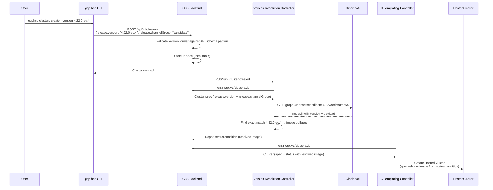

# Adopt Cincinnati for Version Resolution, Selection, and Upgrades

## Overview

This document describes the implementation plan for replacing the hardcoded release image with controller-driven version resolution via Cincinnati, enabling OCP version selection during cluster creation across the GCP HCP stack (CLI, Backend, Controller).

**Design Decision**: [adopt-cincinnati-for-version-resolution](../design-decisions/adopt-cincinnati-for-version-resolution.md)

## Architecture

```
User
  │  --version 4.22.0-ec.4 --channel-group candidate
  ▼
CLI (gcphcp)
  │  POST /api/v1/clusters (release.version: "4.22.0-ec.4", release.channelGroup: "candidate")
  ▼
Backend (cls-backend)
  │  Validates version format against API schema pattern
  │  Stores release.version + release.channelGroup in spec
  │  Publishes cluster.created event
  ▼
Version Resolution Controller (NEW)
  │  Reads release.version + release.channelGroup from spec
  │  Queries Cincinnati: GET /graph?channel=candidate-4.22&arch=amd64
  │  Finds exact match for 4.22.0-ec.4 → image pullspec
  │  Reports resolved image as status condition
  ▼
HC Templating Controller (existing)
  │  Reads resolved image from status condition
  │  Templates HostedCluster CR with spec.release.image
  ▼
HyperShift HostedCluster
```

### Version Selection at Cluster Creation



---

## Implementation Tasks

### Task 1: CLS Backend — Add channelGroup and Version Pattern

**Repo**: `cls-backend`
**Files**: `internal/models/cluster.go`, `docs/reference/openapi-spec.yaml`

#### Changes Required

**1a. Add channelGroup to ReleaseSpec:**

The `ReleaseSpec` already has `Image` and `Version` fields. Add `ChannelGroup`:

```go
type ReleaseSpec struct {
    Image        string `json:"image"`
    Version      string `json:"version"`
    ChannelGroup string `json:"channelGroup,omitempty"` // "stable", "fast", "candidate"
}
```

- `ChannelGroup` defaults to the `DEFAULT_CHANNEL_GROUP` environment variable (e.g., `"stable"` in production, `"candidate"` in integration); persisted so upgrades use the same channel group

**1b. Add version pattern to OpenAPI schema:**

Add a pattern constraint to the existing `release.version` field:

```yaml
version:
  type: string
  pattern: "^4\\.22\\..+$"
  description: Target OCP version (e.g., "4.22.0" or "4.22.0-ec.4")
```

Requires a full 4.22.x version (bare "4.22" is not accepted). Adding support for a new minor version (e.g., 4.23) means updating the pattern.

**1c. Default channelGroup when not provided:**

If `channelGroup` is not provided, default to the value of the `DEFAULT_CHANNEL_GROUP` environment variable (e.g., `"stable"` in production, `"candidate"` in integration).

**1d. Default version when not provided:**

If `version` is not provided, default to the value of the `DEFAULT_CLUSTER_VERSION` environment variable.

**1e. Validate that version is provided:**

The backend applies defaults (version, channelGroup) before validation. Reject the request if `release.version` is still empty after defaulting. Direct image specification is not supported — all clusters must go through Cincinnati-based version resolution.

#### Verification

- `POST /api/v1/clusters` with `release.version: "4.22.0-ec.4"` succeeds
- `POST /api/v1/clusters` with `release.version: "4.21.3"` is rejected (unsupported minor version)
- `channelGroup` defaults to the environment-configured value when not provided

---

### Task 2: Version Resolution Controller (NEW)

**Repo**: `cls-controller`
**Files**: new Helm chart `deployments/helm-cls-version-resolution-controller/`

#### Changes Required

**2a. Create a new purpose-specific controller:**

The version resolution controller:
- Subscribes to cluster events via Pub/Sub
- Reads `release.version` and `release.channelGroup` from the cluster spec
- Queries Cincinnati to find the exact release image for that version
- Reports the resolved image as a status condition back to the backend

**2b. Cincinnati client:**

```go
type CincinnatiClient struct {
    baseURL string // https://api.openshift.com/api/upgrades_info/v1/graph
}

func (c *CincinnatiClient) ResolveVersion(ctx context.Context, version, channelGroup, arch string) (image string, err error) {
    // Extract major.minor from full version to derive the Cincinnati channel
    // e.g., version "4.22.0-ec.4" → "4.22", channelGroup "candidate" → channel "candidate-4.22"
    parts := strings.SplitN(version, ".", 3)
    if len(parts) < 2 {
        return "", fmt.Errorf("invalid version format: %s", version)
    }
    channel := fmt.Sprintf("%s-%s.%s", channelGroup, parts[0], parts[1])

    // GET {baseURL}?channel={channel}&arch={arch}
    // Parse response: find exact match for version in nodes[]
    // Return the matching node's payload (image pullspec)
    // Error if version not found in channel
}
```

**Cincinnati response format:**
```json
{
  "nodes": [
    { "version": "4.22.0-ec.4", "payload": "quay.io/openshift-release-dev/ocp-release@sha256:..." },
    { "version": "4.22.0-ec.3", "payload": "quay.io/openshift-release-dev/ocp-release@sha256:..." }
  ],
  "edges": [[0, 1]]
}
```

Note: The image field in Cincinnati nodes is `payload`, not `image`.

**2c. Status condition reporting:**

The controller reports the resolved image as a status condition:

```go
update := sdk.NewStatusUpdate(clusterID, "cls-version-resolution-controller", generation)
update.SetMetadata("release_image", resolvedImage)
update.SetMetadata("release_version", resolvedVersion)
update.SetMetadata("release_channel_group", channelGroup)
update.SetMetadata("release_channel", channel)
update.SetAppliedTrue("VersionResolved", fmt.Sprintf("Resolved %s to %s", version, resolvedVersion))
client.ReportStatus(update)
```

If resolution fails (e.g., Cincinnati unavailable, empty channel):

```go
update.SetAppliedFalse("ResolutionFailed", fmt.Sprintf("Failed to resolve version %s in channel %s: %v", version, channel, err))
client.ReportStatus(update)
```

**2d. Preconditions:**

The controller should only act when `release.version` is set in the cluster spec.

**2e. ControllerConfig Helm chart:**

Create a new Helm chart at `deployments/helm-cls-version-resolution-controller/` with:
- ControllerConfig CR defining the controller name and preconditions
- Pub/Sub subscription configuration
- No resource templates (this controller only reports status, doesn't create k8s resources)

#### Verification

- Deploy the controller
- Create a cluster with `release.version: "4.22.0-ec.4"` and `channelGroup: "candidate"`
- Verify the controller reports a status condition with the resolved image
- Verify the condition contains the correct image pullspec from Cincinnati
- Test with an invalid version — verify the controller reports a failure condition

---

### Task 3: HC Templating Controller — Read Resolved Image from Status

**Repo**: `cls-controller`
**Files**:
- `internal/template/engine.go` — expose cluster status in template context
- `deployments/helm-cls-hypershift-client/templates/controllerconfig.yaml` — template change
- `deployments/helm-cls-nodepool-controller/templates/controllerconfig.yaml` — template change

#### Changes Required

**3a. Expose cluster status in template context:**

The `buildClusterContext` function currently only exposes `.cluster.spec`. Add `.cluster.status`:

```go
func (e *Engine) buildClusterContext(cluster *sdk.Cluster) map[string]interface{} {
    clusterCtx := map[string]interface{}{
        "id":         cluster.ID,
        "name":       cluster.Name,
        "generation": cluster.Generation,
        "created_by": cluster.CreatedBy,
    }

    var spec map[string]interface{}
    if err := json.Unmarshal(cluster.Spec, &spec); err == nil {
        clusterCtx["spec"] = spec
    }

    // Expose status for template rendering (e.g., resolved release image)
    if cluster.Status != nil {
        statusBytes, err := json.Marshal(cluster.Status)
        if err == nil {
            var status map[string]interface{}
            if err := json.Unmarshal(statusBytes, &status); err == nil {
                clusterCtx["status"] = status
            }
        }
    }

    return clusterCtx
}
```

**3b. Add precondition:** The HC templating controller should wait for the version resolution controller to report a successful condition before templating the HostedCluster.

**3c. Update HostedCluster template to read from status:**

```yaml
# Before:
spec:
  release:
    image: quay.io/openshift-release-dev/ocp-release:4.20.0-x86_64

# After:
spec:
  release:
    image: {{ `{{ (index .cluster.status.controller_statuses "cls-version-resolution-controller").metadata.release_image }}` }}
  channel: {{ `{{ (index .cluster.status.controller_statuses "cls-version-resolution-controller").metadata.release_channel }}` }}
```

**3d. Update NodePool template similarly:**

```yaml
# After:
release:
  image: {{ `{{ (index .cluster.status.controller_statuses "cls-version-resolution-controller").metadata.release_image }}` }}
```

#### Verification

- Deploy updated controller
- Create a cluster with `release.version: "4.22.0-ec.4"`
- Verify the HostedCluster is created with the image resolved by the version resolution controller
- Verify `oc get hostedcluster -o jsonpath='{.spec.release.image}'` matches the Cincinnati pullspec

---

### Task 4: CLI — Version Flag on Cluster Create

**Repo**: `gcp-hcp-cli`
**File**: `src/gcphcp/cli/commands/clusters.py`

#### Changes Required

Add `--version` and `--channel-group` flags to `clusters create`.

```bash
# Create with version (defaults to stable channel group)
gcphcp clusters create my-cluster --project my-project --version 4.22.0

# Create with version from a specific channel group
gcphcp clusters create my-cluster --project my-project --version 4.22.0-ec.4 --channel-group candidate
```

Update `_build_cluster_spec()` to include the version fields:

```python
if version:
    cluster_data["spec"]["release"] = {"version": version}
    if channel_group:
        cluster_data["spec"]["release"]["channelGroup"] = channel_group
```

Direct image specification is not supported — all clusters use Cincinnati-based version resolution. If `--version` is omitted, the backend applies a default version.

#### Verification

- `gcphcp clusters create --version 4.22.0-ec.4` creates cluster with version in spec
- `gcphcp clusters create --version 4.22.0-ec.4 --channel-group candidate` creates cluster with version and channel group in spec
- `gcphcp clusters create` without `--version` succeeds (backend applies default version)

---

## Stories

The implementation tasks above map to 3 stories:

### Story 1: CLS Backend — channelGroup and Version Pattern

**Repo**: `cls-backend`
**Tasks**: 1 (Add channelGroup field and version pattern to API schema)
**Story Points**: 1 — Add one field to ReleaseSpec and a version pattern to the API schema. Simple, low risk.

**Acceptance Criteria**:
- [ ] `POST /api/v1/clusters` with `release.version: "4.22.0-ec.4"` stores version and channel group in spec
- [ ] `POST /api/v1/clusters` with unsupported version (e.g., `4.21.3`) is rejected by API schema pattern
- [ ] `channelGroup` defaults to the configured `DEFAULT_CHANNEL_GROUP` value when not provided

### Story 2: CLS Controller — Version Resolution Controller and Template Updates

**Repos**: `cls-controller`, `gcp-hcp-infra`
**Tasks**: 2 (Version resolution controller), 3 (HC templating controller updates)
**Story Points**: 3 — New controller using existing CLS controller framework (Pub/Sub, status reporting, Helm chart structure). Cincinnati client is a simple HTTP GET + JSON parse. Go code change to expose status in templates is minimal. Includes ArgoCD deployment config and e2e pipeline updates to pass `--version` and `--channel-group` flags.

**Acceptance Criteria**:
- [ ] Version resolution controller resolves `release.version` to a release image via Cincinnati and reports it as a status condition
- [ ] HC templating controller reads the resolved image from the status condition (not hardcoded)
- [ ] HostedCluster is created with the correct release image from Cincinnati
- [ ] NodePool is created with the correct release image
- [ ] Resolution failure is reported as a failed condition (not a silent failure)
- [ ] Version resolution controller is deployed via ArgoCD
- [ ] E2e pipeline passes `--version` and `--channel-group` to cluster creation

### Story 3: CLI — Version Selection Flag

**Repo**: `gcp-hcp-cli`
**Tasks**: 4 (Version flag on cluster create)
**Story Points**: 2 — Add `--version` and `--channel-group` flags, straightforward wiring to backend.

**Acceptance Criteria**:
- [ ] `gcphcp clusters create --version 4.22.0-ec.4 --channel-group candidate` creates a cluster with the version in spec
- [ ] `gcphcp clusters create --version 4.22.0` uses the configured default channel group
- [ ] `gcphcp clusters create` without `--version` succeeds (backend applies default version)

### Implementation Order

| Step | Story | Points | Dependencies |
|------|-------|--------|-------------|
| 1 | Story 1: Backend | 1 | None |
| 2 | Story 2: Controller | 3 | Story 1 |
| 3 | Story 3: CLI | 2 | Story 1 |

**Total: 6 story points**

Stories 2 and 3 depend on Story 1 but can be worked in parallel after Story 1 is complete.
