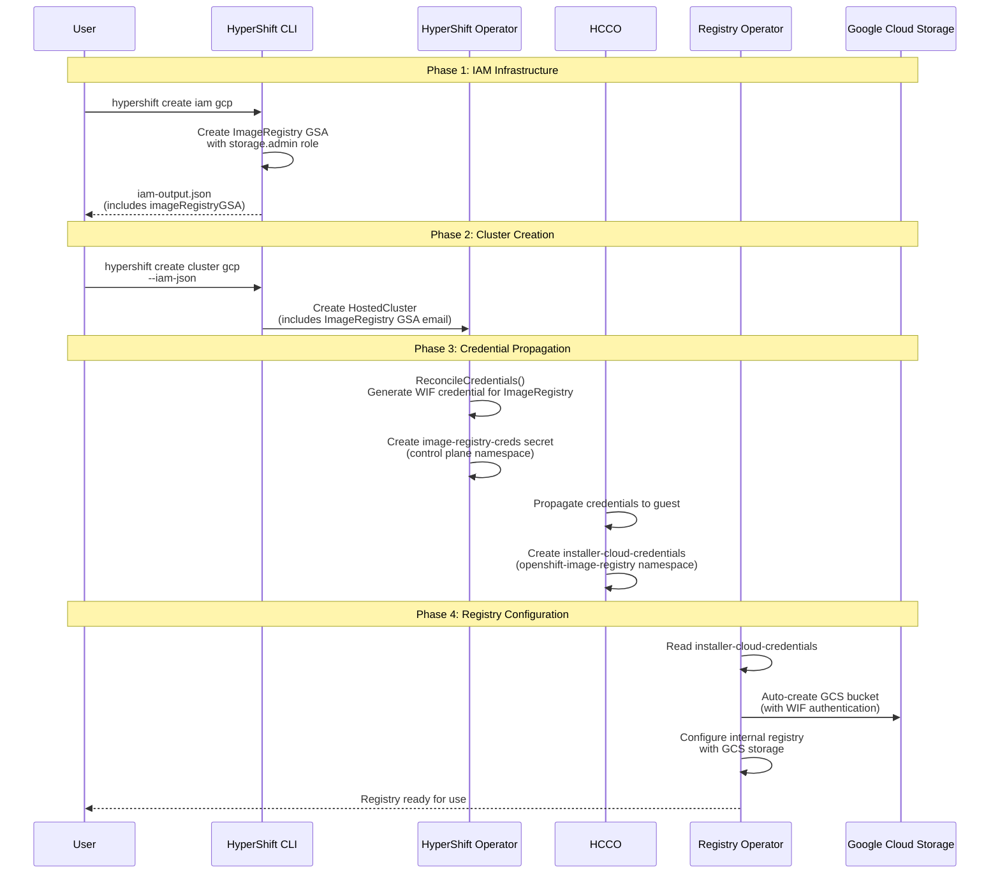

# GCP-321: Image Registry Operator GCP Integration

## Overview

This document outlines the implementation plan for enabling the Image Registry Operator on GCP Hosted Control Planes using GCS storage with Workload Identity Federation (WIF) authentication. The implementation extends the GCP platform foundation established in PR #7305 and the WIF credentials pattern from PR #7307.

**Epic**: GCP-315 - Image Registry Support for GCP Hosted Control Planes

**Prerequisites**:
- PR #7305 (GCP platform foundation) - merged
- PR #7600 (WIF credentials support) - merged (supersedes #7307)

## Executive Summary

### What This Enables

- **GCS-backed Image Registry**: Internal container registry using Google Cloud Storage
- **Keyless Authentication**: Workload Identity Federation for secure, credential-less access
- **Automatic Bucket Management**: Registry operator auto-creates and manages GCS buckets
- **Full HyperShift Integration**: Seamless integration with existing GCP HCP infrastructure

### How It Works



## Background Research

### Upstream Registry Operator GCS Support

The `cluster-image-registry-operator` already has comprehensive GCS support:

| Feature | Status | Details |
|---------|--------|---------|
| **HCP Compatibility** | ✅ Ready | `include.release.openshift.io/hypershift: "true"` |
| **GCS Driver** | ✅ Exists | `pkg/storage/gcs/gcs.go` - full implementation |
| **Auto Bucket Creation** | ✅ Supported | Operator creates buckets when none specified |
| **WIF Authentication** | ✅ Compatible | Uses standard GCP SDK credential loading |

### Credential Requirements

**Expected Secret**: `installer-cloud-credentials` in `openshift-image-registry` namespace

**Required Key**: `service_account.json`

**Credential Format** (WIF external_account):
```json
{
  "type": "external_account",
  "audience": "//iam.googleapis.com/projects/PROJECT_NUMBER/locations/global/workloadIdentityPools/POOL_ID/providers/PROVIDER_ID",
  "subject_token_type": "urn:ietf:params:oauth:token-type:jwt",
  "token_url": "https://sts.googleapis.com/v1/token",
  "service_account_impersonation_url": "https://iamcredentials.googleapis.com/v1/projects/-/serviceAccounts/GSA_EMAIL:generateAccessToken",
  "credential_source": {
    "file": "/var/run/secrets/openshift/serviceaccount/token"
  }
}
```

### Required IAM Permissions

| Permission | Purpose | Role |
|------------|---------|------|
| `storage.buckets.create` | Create GCS bucket | `roles/storage.admin` |
| `storage.buckets.delete` | Delete bucket on cleanup | `roles/storage.admin` |
| `storage.buckets.get` | Check bucket existence | `roles/storage.admin` |
| `storage.buckets.list` | List buckets | `roles/storage.admin` |
| `storage.objects.*` | Manage container images | `roles/storage.admin` |
| `storage.buckets.createTagBinding` | Apply resource tags | `roles/storage.admin` |
| `resourcemanager.tagValueBindings.create` | Create tag bindings | `roles/storage.admin` |

**Recommended Role**: `roles/storage.admin` (comprehensive storage operations)

### Bucket Lifecycle

- **Creation**: Registry operator auto-creates bucket (recommended approach)
- **Naming**: Auto-generated based on `infra-id` and region (e.g., `{infra-id}-image-registry-{region}`)
- **Deletion**: Operator handles cleanup when `ManagementState: Managed`
- **Location**: Single region matching cluster region

**Note on Bucket Naming**: The upstream registry operator's `GenerateStorageName()` function (`pkg/storage/util/util.go`) automatically handles GCS's 63-character bucket name limit by truncating to 62 characters and adding random padding. No special handling is required in HyperShift.

## Implementation Tasks

### Task 1: API Extension - ImageRegistry Field

**Component**: API
**Files**: `api/hypershift/v1beta1/gcp.go`

#### Changes Required

Extend `GCPServiceAccountsEmails` struct to include ImageRegistry GSA:

```go
type GCPServiceAccountsEmails struct {
    // nodePool is the Google Service Account email for node pool management
    // +required
    // +immutable
    NodePool string `json:"nodePool"`

    // controlPlane is the Google Service Account email for control plane operations
    // +required
    // +immutable
    ControlPlane string `json:"controlPlane"`

    // imageRegistry is the Google Service Account email for the Image Registry Operator
    // that manages GCS buckets for container image storage.
    // This GSA requires roles/storage.admin IAM role.
    // Format: service-account-name@project-id.iam.gserviceaccount.com
    //
    // +required
    // +immutable
    // +kubebuilder:validation:Pattern=`^[a-z][a-z0-9-]{4,28}[a-z0-9]@[a-z][a-z0-9-]{4,28}[a-z0-9]\.iam\.gserviceaccount\.com$`
    ImageRegistry string `json:"imageRegistry"`
}
```

Add CEL validation to `GCPPlatformSpec`:

```go
// +kubebuilder:validation:XValidation:rule="self.workloadIdentity.serviceAccountsEmails.imageRegistry.contains('@') && self.workloadIdentity.serviceAccountsEmails.imageRegistry.endsWith('@' + self.project + '.iam.gserviceaccount.com')",message="imageRegistry service account must belong to the same project"
```

#### Verification

1. Run `make api` - should regenerate CRDs without errors
2. Run `make verify` - API validation passes
3. Check generated CRD has ImageRegistry field with proper validation

#### Implementation Notes

- Pattern validation ensures GSA email format correctness
- CEL validation ensures GSA belongs to the correct GCP project
- Field is required and immutable (consistent with other GSA fields)

---

### Task 2: HyperShift Operator - Credential Reconciliation

**Component**: HyperShift Operator
**Files**: `hypershift-operator/controllers/hostedcluster/internal/platform/gcp/gcp.go`

#### Changes Required

Add ImageRegistry credential secret function:

```go
// ImageRegistryCredsSecret returns the secret containing WIF credentials for Image Registry
func ImageRegistryCredsSecret(controlPlaneNamespace string) *corev1.Secret {
    return &corev1.Secret{
        ObjectMeta: metav1.ObjectMeta{
            Namespace: controlPlaneNamespace,
            Name:      "image-registry-creds",
        },
    }
}
```

Extend `ReconcileCredentials()` to include ImageRegistry:

```go
// In ReconcileCredentials(), extend the syncSecret loop:
for email, secret := range map[string]*corev1.Secret{
    hcluster.Spec.Platform.GCP.WorkloadIdentity.ServiceAccountsEmails.NodePool:      NodePoolManagementCredsSecret(controlPlaneNamespace),
    hcluster.Spec.Platform.GCP.WorkloadIdentity.ServiceAccountsEmails.ControlPlane:  ControlPlaneOperatorCredsSecret(controlPlaneNamespace),
    hcluster.Spec.Platform.GCP.WorkloadIdentity.ServiceAccountsEmails.ImageRegistry: ImageRegistryCredsSecret(controlPlaneNamespace),
} {
    if err := syncSecret(secret, email); err != nil {
        errs = append(errs, err)
    }
}
```

#### Verification

1. Unit test: Verify ImageRegistry credential secret is created
2. Unit test: Verify WIF credential format is correct for ImageRegistry GSA
3. Integration test: Secret appears in control plane namespace after cluster creation

#### Implementation Notes

- Follow the established pattern from PR #7307 for WIF credential generation
- The `syncSecret` function handles the WIF credential JSON generation
- Secret name `image-registry-creds` is used in HCCO for propagation

---

### Task 3: CLI - IAM Infrastructure Extension

**Component**: HyperShift CLI
**Files**: `cmd/infra/gcp/iam-bindings.json`

#### Implementation

Use the `/add-gcp-service-account` slash command to generate the IAM binding configuration:

**Parameters**:
- **name**: `image-registry`
- **displayName**: `HyperShift Image Registry Operator`
- **description**: `Service account for Image Registry Operator GCS storage operations`
- **roles**: `roles/storage.admin`
- **k8sServiceAccount.namespace**: `openshift-image-registry`
- **k8sServiceAccount.name**: `cluster-image-registry-operator`

The skill will generate the JSON entry to add to `cmd/infra/gcp/iam-bindings.json`. The file uses `//go:embed` to load GSA definitions at compile time, so no Go code changes are needed.

**Expected Output Format** (added to `iam-bindings.json`):
```json
{
  "name": "image-registry",
  "displayName": "HyperShift Image Registry Operator",
  "description": "Service account for Image Registry Operator GCS storage operations",
  "roles": ["roles/storage.admin"],
  "k8sServiceAccount": {
    "namespace": "openshift-image-registry",
    "name": "cluster-image-registry-operator"
  }
}
```

The IAM output JSON will automatically include the ImageRegistry GSA email in the service accounts map:
```json
{
  "serviceAccounts": {
    "nodePoolGSA": "...",
    "controlPlaneGSA": "...",
    "imageRegistryGSA": "{infra-id}-image-registry@{project}.iam.gserviceaccount.com"
  }
}
```

#### Verification

1. Run `hypershift create iam gcp --dry-run` - should show ImageRegistry GSA creation
2. Verify output JSON includes `imageRegistryGSA` field with correct email
3. Test actual IAM creation in GCP project - GSA created with `roles/storage.admin`
4. Verify WIF binding created for `openshift-image-registry/cluster-image-registry-operator`

#### Post-Implementation

Provide feedback on the `/add-gcp-service-account` skill effectiveness:
- Did it generate correct output?
- Were any manual adjustments needed?
- Update the skill documentation if improvements are discovered

---

### Task 4: CLS Stack Updates

**Component**: CLS Stack (cls-backend, cls-controller, gcp-hcp-cli)
**Repositories**: External to HyperShift - separate JIRA tracking required

#### Overview

The CLS (Cluster Lifecycle Service) stack bridges HyperShift with the GCP HCP managed service. These updates enable the CLS stack to pass the ImageRegistry GSA email from the IAM configuration through to the HostedCluster CR.

#### Changes Required

**1. cls-backend** (`internal/models/cluster.go`)

Add `imageRegistryEmail` to the `WIFServiceAccountsRef` struct:

```go
type WIFServiceAccountsRef struct {
    NodePoolEmail        string `json:"nodePoolEmail"`
    ControlPlaneEmail    string `json:"controlPlaneEmail"`
    ImageRegistryEmail   string `json:"imageRegistryEmail"`  // NEW
}
```

**2. cls-controller** (`deployments/helm-cls-hypershift-client/templates/controllerconfig.yaml`)

Add the `imageRegistry` field to the HostedCluster template:

```yaml
workloadIdentity:
  serviceAccountsEmails:
    nodePool: {{`{{ .cluster.spec.platform.gcp.workloadIdentity.serviceAccountsRef.nodePoolEmail }}`}}
    controlPlane: {{`{{ .cluster.spec.platform.gcp.workloadIdentity.serviceAccountsRef.controlPlaneEmail }}`}}
    imageRegistry: {{`{{ .cluster.spec.platform.gcp.workloadIdentity.serviceAccountsRef.imageRegistryEmail }}`}}  # NEW
```

**3. gcp-hcp-cli** (`src/gcphcp/utils/hypershift.py`)

Update `SERVICE_ACCOUNTS` constant:
```python
SERVICE_ACCOUNTS = {
    "ctrlplane-op": "Control Plane Operator",
    "nodepool-mgmt": "Node Pool Management",
    "image-registry": "Image Registry Operator",  # NEW
}
```

Update `iam_config_to_wif_spec` function:
```python
def iam_config_to_wif_spec(iam_config: Dict[str, Any]) -> Dict[str, Any]:
    return {
        "serviceAccountsRef": {
            "controlPlaneEmail": service_accounts.get("ctrlplane-op"),
            "nodePoolEmail": service_accounts.get("nodepool-mgmt"),
            "imageRegistryEmail": service_accounts.get("image-registry"),  # NEW
        },
    }
```

#### Merge Order

**Critical**: These changes must merge in specific order after HyperShift changes:

1. **hypershift** (Tasks 1-3) - API and IAM changes must be merged first
2. **gcp-hcp-cli** - CLI support for parsing IAM output
3. **cls-backend** - Backend model/API contract update
4. **cls-controller** - HostedCluster template update (merge last)

#### Verification

1. After all merges, run full E2E test with CLS stack
2. Verify `gcphcp cluster create` passes ImageRegistry GSA to HostedCluster
3. Verify cluster provisions with working image registry
4. Check CLS backend API returns `imageRegistryEmail` in cluster spec

#### Implementation Reference

Use the `/add-gcp-service-account` skill for detailed CLS implementation patterns.

#### Dependencies

| Dependency | Status | Notes |
|------------|--------|-------|
| Task 1 (API Extension) | Required | Must merge before cls-backend |
| Task 3 (CLI IAM) | Required | Defines output format gcp-hcp-cli parses |

#### What This Task Blocks

- Task 8 (E2E Testing) - Full E2E requires CLS stack integration

---

### Task 5: HCCO - Credential Propagation and GCP Package

**Component**: Hosted Cluster Config Operator (HCCO)
**Files**:
- `control-plane-operator/hostedclusterconfigoperator/controllers/resources/manifests/creds.go` (NEW function)
- `control-plane-operator/hostedclusterconfigoperator/controllers/resources/gcp/gcp.go` (NEW file)
- `control-plane-operator/hostedclusterconfigoperator/controllers/resources/resources.go` (extend reconciliation)

#### Changes Required

**Step 4.1**: Add manifest function for ImageRegistry secret:

```go
// In manifests/creds.go
func GCPImageRegistryCloudCredsSecret() *corev1.Secret {
    return &corev1.Secret{
        ObjectMeta: metav1.ObjectMeta{
            Namespace: "openshift-image-registry",
            Name:      "installer-cloud-credentials",
        },
    }
}
```

**Step 4.2**: Create GCP-specific reconciliation package (NEW file):

```go
// File: control-plane-operator/hostedclusterconfigoperator/controllers/resources/gcp/gcp.go
package gcp

import (
    "context"
    "fmt"

    hyperv1 "github.com/openshift/hypershift/api/hypershift/v1beta1"
    "github.com/openshift/hypershift/control-plane-operator/hostedclusterconfigoperator/controllers/resources/manifests"
    "github.com/openshift/hypershift/support/capabilities"
    "github.com/openshift/hypershift/support/upsert"
    corev1 "k8s.io/api/core/v1"
    "sigs.k8s.io/controller-runtime/pkg/client"
)

// GCPWIFConfig contains WIF configuration for credential generation
type GCPWIFConfig struct {
    ProjectNumber      string
    PoolID             string
    ProviderID         string
    ImageRegistryGSA   string
}

// gcpCredentialConfig defines configuration for a single credential secret
type gcpCredentialConfig struct {
    Name              string
    ManifestFunc      func() *corev1.Secret
    ServiceAccountEmail string
    CapabilityChecker func(capabilities.CapabilityMap) bool
    ErrorContext      string
}

// SetupOperandCredentials reconciles all GCP operand credentials for the guest cluster
func SetupOperandCredentials(
    ctx context.Context,
    client client.Client,
    upsertProvider upsert.CreateOrUpdateProvider,
    hcp *hyperv1.HostedControlPlane,
    wifConfig GCPWIFConfig,
) []error {
    configs := []gcpCredentialConfig{
        {
            Name:              "imageRegistry",
            ManifestFunc:      manifests.GCPImageRegistryCloudCredsSecret,
            ServiceAccountEmail: wifConfig.ImageRegistryGSA,
            CapabilityChecker: capabilities.IsImageRegistryCapabilityEnabled,
            ErrorContext:      "guest cluster image-registry secret",
        },
        // Additional credentials can be added here in the future
    }

    return reconcileGCPCredentials(ctx, client, upsertProvider, hcp, configs)
}

// reconcileGCPCredentials handles the reconciliation of GCP credential secrets
func reconcileGCPCredentials(
    ctx context.Context,
    client client.Client,
    upsertProvider upsert.CreateOrUpdateProvider,
    hcp *hyperv1.HostedControlPlane,
    configs []gcpCredentialConfig,
) []error {
    var errs []error

    for _, config := range configs {
        secret := config.ManifestFunc()
        if _, err := upsertProvider.CreateOrUpdate(ctx, client, secret, func() error {
            return reconcileGCPCredential(secret, config.ServiceAccountEmail, hcp)
        }); err != nil {
            errs = append(errs, fmt.Errorf("failed to reconcile %s: %w", config.ErrorContext, err))
        }
    }

    return errs
}

// reconcileGCPCredential populates a secret with GCP WIF credentials
func reconcileGCPCredential(secret *corev1.Secret, gsaEmail string, hcp *hyperv1.HostedControlPlane) error {
    // Generate WIF credential JSON
    credentialJSON := generateWIFCredential(gsaEmail, hcp)

    if secret.Data == nil {
        secret.Data = make(map[string][]byte)
    }
    secret.Data["service_account.json"] = credentialJSON

    return nil
}

// generateWIFCredential creates the WIF credential JSON for a given GSA
func generateWIFCredential(gsaEmail string, hcp *hyperv1.HostedControlPlane) []byte {
    // Implementation should match the pattern from HyperShift Operator's ReconcileCredentials
    // This will be similar to the credential generation in gcp.go from the HyperShift operator
    // Placeholder - actual implementation follows the WIF credential format
    return []byte(fmt.Sprintf(`{
  "type": "external_account",
  "audience": "//iam.googleapis.com/projects/%s/locations/global/workloadIdentityPools/%s/providers/%s",
  "subject_token_type": "urn:ietf:params:oauth:token-type:jwt",
  "token_url": "https://sts.googleapis.com/v1/token",
  "service_account_impersonation_url": "https://iamcredentials.googleapis.com/v1/projects/-/serviceAccounts/%s:generateAccessToken",
  "credential_source": {
    "file": "/var/run/secrets/openshift/serviceaccount/token"
  }
}`,
        hcp.Spec.Platform.GCP.ProjectNumber,
        hcp.Spec.Platform.GCP.WorkloadIdentity.PoolID,
        hcp.Spec.Platform.GCP.WorkloadIdentity.ProviderID,
        gsaEmail))
}
```

**Step 4.3**: Integrate into resources controller:

```go
// In resources.go, add GCP case to reconciliation:
if hcp.Spec.Platform.Type == hyperv1.GCPPlatform {
    wifConfig := gcp.GCPWIFConfig{
        ProjectNumber:    hcp.Spec.Platform.GCP.ProjectNumber,
        PoolID:           hcp.Spec.Platform.GCP.WorkloadIdentity.PoolID,
        ProviderID:       hcp.Spec.Platform.GCP.WorkloadIdentity.ProviderID,
        ImageRegistryGSA: hcp.Spec.Platform.GCP.WorkloadIdentity.ServiceAccountsEmails.ImageRegistry,
    }

    if errs := gcp.SetupOperandCredentials(ctx, r.client, r.upsertProvider, hcp, wifConfig); len(errs) > 0 {
        return fmt.Errorf("failed to setup GCP operand credentials: %v", errs)
    }
}
```

#### Verification

1. Unit test: Verify secret manifest is created correctly
2. Unit test: Verify WIF credential JSON format is valid
3. Unit test: Verify capability checking works correctly
4. Integration test: Secret propagates to guest cluster namespace
5. Integration test: Secret contains valid `service_account.json` key

#### Implementation Notes

- **Pattern matching**: This follows the AWS (`aws/aws.go`) and Azure (`azure/azure.go`) package structure
- **GCPWIFConfig**: Consolidates WIF configuration needed for credential generation
- **Capability checking**: Ensures registry credentials are only created when the capability is enabled
- **Error handling**: Returns multiple errors to surface all issues during reconciliation
- **Future extensibility**: The `gcpCredentialConfig` slice allows easy addition of other credentials (e.g., DNS, ingress)

---

### Task 6: CPO - Infrastructure Configuration

**Component**: Control Plane Operator (CPO)
**Files**: `control-plane-operator/controllers/hostedcontrolplane/v2/infrastructure/deployment.go` or similar infrastructure reconciliation file

#### Changes Required

Ensure Infrastructure CR includes GCP platform status for registry operator:

```go
// In the infrastructure reconciliation function (exact location depends on CPO v2 structure)
func reconcileInfrastructure(hcp *hyperv1.HostedControlPlane) *configv1.Infrastructure {
    infra := &configv1.Infrastructure{
        ObjectMeta: metav1.ObjectMeta{
            Name: "cluster",
        },
        Spec: configv1.InfrastructureSpec{
            PlatformSpec: configv1.PlatformSpec{
                Type: configv1.GCPPlatformType,
            },
        },
    }

    // Set status fields for GCP platform
    if hcp.Spec.Platform.Type == hyperv1.GCPPlatform {
        infra.Status.PlatformStatus = &configv1.PlatformStatus{
            Type: configv1.GCPPlatformType,
            GCP: &configv1.GCPPlatformStatus{
                ProjectID: hcp.Spec.Platform.GCP.Project,
                Region:    hcp.Spec.Platform.GCP.Region,
            },
        }
    }

    return infra
}
```

#### Verification

1. Unit test: Verify Infrastructure CR has correct GCP platform status
2. Integration test: `oc get infrastructure cluster -o yaml` shows GCP platform status
3. Verify registry operator can read region and projectID from Infrastructure CR

#### Implementation Notes

- **Infrastructure CR**: Used by registry operator to determine bucket location (region)
- **ProjectID**: Required for GCS bucket operations
- **CPO v2 structure**: Exact file location may vary - look for infrastructure reconciliation in CPO v2
- **Fallback verification**: If file path is unclear after PR merges, search for `reconcile.*Infrastructure` or where Infrastructure CR status is set

---

### Task 7: Unit Tests

**Component**: All modified packages
**Files**: Various `*_test.go` files across all components

#### Test Coverage Required

**API Tests** (`api/hypershift/v1beta1/gcp_test.go`):
- Validate ImageRegistry field accepts valid GSA emails
- Validate ImageRegistry field rejects invalid formats
- Validate CEL rule enforces same-project constraint
- Validate field is required and immutable

**HyperShift Operator Tests** (`hypershift-operator/.../gcp/gcp_test.go`):
- Verify ReconcileCredentials creates image-registry-creds secret
- Verify WIF credential JSON has correct structure
- Verify credential includes correct GSA email and audience
- Verify reconciliation errors are handled correctly

**CLI Tests** (`cmd/infra/gcp/create_iam_test.go`):
- Verify ImageRegistry GSA is included in creation plan
- Verify output JSON includes imageRegistryGSA field
- Verify WIF binding configuration is correct
- Verify --dry-run mode shows ImageRegistry GSA

**HCCO Tests** (`control-plane-operator/.../gcp/gcp_test.go`):
- Verify SetupOperandCredentials creates installer-cloud-credentials secret
- Verify secret contains service_account.json key
- Verify WIF credential format matches expected structure
- Verify capability checking prevents credential creation when disabled
- Verify error handling returns meaningful error messages

**CPO Tests** (`control-plane-operator/.../infrastructure_test.go`):
- Verify Infrastructure CR includes GCP platform status
- Verify ProjectID and Region are set correctly
- Verify status is set for GCP platform type only

#### Verification

1. Run `make test` - all unit tests pass
2. Code coverage remains above project threshold (typically 70%+)
3. Tests follow existing test patterns in each package

#### Implementation Notes

- Use table-driven tests where appropriate
- Mock external dependencies (GCP API calls, K8s client)
- Test both success and failure paths
- Verify error messages are helpful for debugging

---

### Task 8: E2E Testing

**Component**: End-to-end testing
**Files**: E2E test suite (location depends on project structure)

#### Test Scenarios

**Scenario 1: Full Cluster Lifecycle**
1. Create IAM infrastructure with ImageRegistry GSA
2. Verify imageRegistryGSA appears in iam-output.json
3. Create GCP hosted cluster with IAM JSON
4. Verify image-registry-creds secret in control plane namespace
5. Verify installer-cloud-credentials secret in openshift-image-registry namespace
6. Wait for registry operator deployment to be ready
7. Verify GCS bucket is created in correct project and region
8. Verify `oc get configs.imageregistry.operator.openshift.io cluster` shows GCS storage configured

**Scenario 2: Registry Functionality**
1. Build a test container image
2. Push image to internal registry: `docker push image-registry.openshift-image-registry.svc:5000/test/image:tag`
3. Pull image from internal registry
4. Verify image layers are stored in GCS bucket

**Scenario 3: Cleanup**
1. Delete the hosted cluster
2. Verify GCS bucket is deleted
3. Run `hypershift destroy iam gcp`
4. Verify ImageRegistry GSA is deleted

**Scenario 4: Error Handling**
1. Create cluster with invalid imageRegistryGSA email
2. Verify appropriate error message
3. Create cluster with missing imageRegistryGSA field
4. Verify validation error

#### Verification

1. All E2E scenarios pass on test GCP project
2. No credential errors in registry operator logs
3. Bucket created with correct naming convention
4. Cleanup successfully removes all resources

#### Implementation Notes

- Use dedicated GCP test project
- Implement proper cleanup in test teardown
- Capture logs from registry operator for debugging
- Test with both managed and unmanaged bucket scenarios (if supported)

---

### Task 9: Documentation

**Component**: Documentation
**Files**:
- `docs/content/how-to/gcp/create-gcp-cluster.md` (or equivalent)
- `docs/content/how-to/gcp/configure-image-registry.md` (NEW)
- CLI help text in `cmd/infra/gcp/create_iam.go`

#### Documentation Updates Required

**1. IAM Infrastructure Documentation**

Update `hypershift create iam gcp` command help text:

```markdown
## Google Service Accounts Created

The following Google Service Accounts are created for cluster operations:

| GSA | Purpose | IAM Role |
|-----|---------|----------|
| {infra-id}-node-pool | Node pool management | roles/compute.admin |
| {infra-id}-control-plane | Control plane operations | roles/compute.admin |
| {infra-id}-image-registry | Image registry GCS storage | roles/storage.admin |

### Image Registry GSA

The Image Registry GSA (`{infra-id}-image-registry@{project}.iam.gserviceaccount.com`)
provides the image registry operator with permissions to:
- Create and delete GCS buckets
- Store and retrieve container images
- Manage bucket lifecycle and permissions
```

**2. Cluster Creation Documentation**

Add section to GCP cluster creation guide:

```markdown
## Image Registry

The internal image registry is automatically configured to use Google Cloud Storage (GCS).

### Automatic Configuration

When you create a GCP hosted cluster, the image registry operator:
1. Creates a GCS bucket named `{infra-id}-image-registry-{region}`
2. Configures the registry to use GCS storage
3. Authenticates using Workload Identity Federation

### Using the Registry

Push images to the internal registry:

```bash
# Get the internal registry route
REGISTRY=$(oc get route default-route -n openshift-image-registry -o jsonpath='{.spec.host}')

# Login to the registry
podman login -u $(oc whoami) -p $(oc whoami -t) $REGISTRY

# Push an image
podman push myimage:latest $REGISTRY/myproject/myimage:latest
```

### Troubleshooting

**Registry not available:**
Check the registry operator status:
```bash
oc get configs.imageregistry.operator.openshift.io cluster -o yaml
```

**Permission errors:**
Verify the ImageRegistry GSA has `roles/storage.admin`:
```bash
gcloud projects get-iam-policy PROJECT_ID \
  --flatten="bindings[].members" \
  --filter="bindings.members:{infra-id}-image-registry@*"
```

**Bucket not created:**
Check registry operator logs:
```bash
oc logs -n openshift-image-registry deployment/cluster-image-registry-operator
```
```

**3. NEW Configuration Guide**

Create `docs/content/how-to/gcp/configure-image-registry.md`:

```markdown
# Configuring the Image Registry on GCP

## Overview

This guide covers advanced configuration options for the image registry on GCP hosted control planes.

## Prerequisites

- GCP hosted cluster created with image registry enabled
- `oc` CLI configured for cluster access

## Configuration Options

### Checking Registry Status

```bash
oc get configs.imageregistry.operator.openshift.io cluster -o yaml
```

### Bucket Configuration

The registry operator automatically creates a GCS bucket. To view bucket details:

```bash
# Get bucket name from registry config
BUCKET=$(oc get configs.imageregistry.operator.openshift.io cluster -o jsonpath='{.spec.storage.gcs.bucket}')

# View bucket details in GCP
gcloud storage buckets describe gs://$BUCKET
```

### Storage Class

The GCS bucket uses regional storage class by default. The region matches your cluster region.

### Management State

The registry operator manages the bucket lifecycle by default:
- `Managed`: Operator creates and deletes bucket
- `Unmanaged`: User-provided bucket (not currently supported)

## Monitoring

### Registry Metrics

View registry metrics:
```bash
oc get prometheus -n openshift-image-registry
```

### Storage Usage

Check GCS bucket size:
```bash
gcloud storage du gs://$BUCKET --summarize
```

## Troubleshooting

See main cluster creation documentation for troubleshooting steps.
```

#### Verification

1. Documentation builds without errors
2. Links work correctly
3. Code examples are tested and accurate
4. Troubleshooting steps actually resolve common issues

#### Implementation Notes

- Use consistent terminology throughout
- Include actual command examples (test them first)
- Add troubleshooting section based on common issues found during testing
- Link to upstream OpenShift registry documentation where appropriate

---

## Implementation Summary

| Task | Component | Dependencies |
|------|-----------|--------------|
| 1. API Extension | API | - |
| 2. Credential Reconciliation | HyperShift Operator | Task 1 |
| 3. IAM Infrastructure | CLI | Task 1 |
| 4. CLS Stack Updates | CLS (external repos) | Task 1, Task 3 |
| 5. Credential Propagation + GCP Package | HCCO | Task 1, Task 2 |
| 6. Infrastructure Config | CPO | Task 1 |
| 7. Unit Tests | All | Task 1-6 |
| 8. E2E Testing | Testing | Task 1-7 |
| 9. Documentation | Docs | Task 1-8 |

## Critical Files to Modify

```
api/hypershift/v1beta1/gcp.go
hypershift-operator/controllers/hostedcluster/internal/platform/gcp/gcp.go
cmd/infra/gcp/create_iam.go
control-plane-operator/hostedclusterconfigoperator/controllers/resources/manifests/creds.go
control-plane-operator/hostedclusterconfigoperator/controllers/resources/gcp/gcp.go (NEW)
control-plane-operator/hostedclusterconfigoperator/controllers/resources/resources.go
control-plane-operator/controllers/hostedcontrolplane/v2/infrastructure/deployment.go (or equivalent)
```

## Dependencies and Prerequisites

| Dependency | Status | Notes |
|------------|--------|-------|
| PR #7305 | ✅ Merged | GCP platform foundation - provides base GCP types |
| PR #7600 | ✅ Merged | WIF credentials pattern - provides ReconcileCredentials pattern (supersedes #7307) |
| upstream registry GCS support | ✅ Exists | No upstream changes needed |

## Gap Analysis vs AWS/Azure

This implementation follows the established patterns from AWS and Azure:

| Component | AWS | Azure | GCP (This Plan) | Status |
|-----------|-----|-------|-----------------|--------|
| **API: Service Account field** | `AWSRolesRef.ImageRegistryARN` | `WorkloadIdentities.ImageRegistry.ClientID` | `GCPServiceAccountsEmails.ImageRegistry` | ✅ Covered |
| **Operator: ReconcileCredentials** | Creates S3 credential secret | Creates blob credential secret | Creates GCS WIF credential | ✅ Covered |
| **CLI: IAM infrastructure** | `imageRegistryPermPolicy` | Handled by Azure infra | `create_iam.go` extension | ✅ Covered |
| **HCCO: Credential manifest** | `AWSImageRegistryCloudCredsSecret()` | `AzureImageRegistryCloudCredsSecret()` | `GCPImageRegistryCloudCredsSecret()` | ✅ Covered |
| **HCCO: Credential propagation** | In `resources.go` AWS case | In `azure/azure.go` | In `gcp/gcp.go` (NEW) | ✅ Covered |
| **CPO: Infrastructure CR** | Sets `PlatformStatus.AWS.Region` | Sets `PlatformStatus.Azure.*` | Sets `PlatformStatus.GCP.*` | ✅ Covered |
| **CPO v2: registryoperator** | Token minter included | Token minter included | Works generically | ✅ N/A |
| **Capability checking** | `IsImageRegistryCapabilityEnabled` | `IsImageRegistryCapabilityEnabled` | Reuse existing | ✅ N/A |

**Conclusion**: This plan achieves feature parity with AWS and Azure image registry implementations.

## Out of Scope (Future Enhancements)

The following features are explicitly out of scope for the initial implementation but documented here for future consideration:

### 1. KMS Encryption for GCS Buckets

**What it involves**:
- Upstream registry operator supports KMS via `keyID` field
- Pass KMS key reference through HyperShift API to guest cluster

**Tasks**:
- API extension
- IAM updates (add KMS permissions)
- CPO/HCCO propagation
- Testing

### 2. Multi-Region Bucket Replication

**What it involves**:
- Configure bucket with dual-region or multi-region location class
- May require upstream registry operator changes

**Tasks**:
- API extension
- Upstream investigation/changes
- CPO/HCCO updates
- Cross-region testing

### 3. Custom Bucket Naming

**What it involves**:
- Allow users to specify bucket name prefix or full bucket name
- Validate against GCS naming requirements

**Tasks**:
- API extension
- HCCO propagation
- Validation/testing

### 4. Bring-Your-Own-Bucket (BYOB) Support

**What it involves**:
- User pre-creates GCS bucket with custom configuration
- Registry operator uses existing bucket (`ManagementState: Unmanaged`)
- Different IAM permissions (no bucket create/delete)

**Tasks**:
- API extension
- IAM conditional logic
- HCCO/CPO updates
- Testing

---

## Verification Checklist

Use this checklist to verify implementation completeness:

### Pre-merge Verification

- [ ] `make api` completes without errors
- [ ] `make verify` passes all checks
- [ ] `make test` passes all unit tests with sufficient coverage
- [ ] API changes include proper validation (CEL, kubebuilder markers)
- [ ] All code follows existing patterns (AWS/Azure equivalents reviewed)
- [ ] Documentation updated and reviewed
- [ ] CLI help text includes ImageRegistry GSA information

### E2E Verification

- [ ] IAM infrastructure creation includes ImageRegistry GSA
- [ ] IAM output JSON contains `imageRegistryGSA` field
- [ ] Cluster creation succeeds with IAM JSON
- [ ] image-registry-creds secret exists in control plane namespace
- [ ] installer-cloud-credentials secret exists in openshift-image-registry namespace
- [ ] Registry operator pod starts without errors
- [ ] GCS bucket created in correct project/region
- [ ] `oc get configs.imageregistry.operator.openshift.io cluster` shows GCS storage
- [ ] Can push image to internal registry
- [ ] Can pull image from internal registry
- [ ] Cluster deletion removes GCS bucket
- [ ] `hypershift destroy iam gcp` removes ImageRegistry GSA

### Post-merge Verification

- [ ] CI/CD pipelines pass
- [ ] No regression in existing GCP cluster functionality
- [ ] Documentation published and accessible
- [ ] Release notes updated (if applicable)

---

## Implementation Notes for Developers

### Finding the Right Files

**After PR #7305 and #7307 merge**, use the following strategies to locate exact file paths if they differ from this plan:

1. **Infrastructure CR reconciliation** (Task 5):
   ```bash
   # Search for where Infrastructure status is set
   rg "Infrastructure.*Status.*PlatformStatus" --type go

   # Look for GCP-specific infrastructure reconciliation
   rg "reconcile.*Infrastructure.*GCP" --type go -i
   ```

2. **HCCO resources controller** (Task 4):
   ```bash
   # Find where platform-specific credential setup happens
   rg "SetupOperandCredentials|reconcile.*credentials" control-plane-operator/hostedclusterconfigoperator/

   # Look for AWS/Azure examples to match pattern
   rg "AWSImageRegistryCloudCredsSecret|AzureImageRegistryCloudCredsSecret" --type go
   ```

3. **WIF credential generation** (Task 2, Task 4):
   ```bash
   # Find the established WIF credential generation pattern from PR #7307
   rg "external_account.*audience.*iam.googleapis.com" --type go
   ```

### Adapting to Actual Code Structure

If the merged PRs have different structures than anticipated:

- **Match existing patterns**: Look at how NodePool and ControlPlane credentials are handled
- **Reuse helper functions**: Don't duplicate credential generation logic
- **Follow package organization**: Place GCP-specific code in gcp/ subdirectories
- **Consistent naming**: Use ImageRegistry (camelCase) in code, image-registry (kebab-case) in K8s resources

### Testing Strategy

1. **Unit tests first**: Verify each component in isolation
2. **Integration tests**: Verify components work together (secret propagation)
3. **E2E last**: Full cluster lifecycle testing

### Common Pitfalls to Avoid

- **Don't skip API validation**: CEL rules prevent invalid configurations
- **Don't hardcode values**: Use constants from HostedControlPlane spec
- **Don't create circular dependencies**: Task order matters
- **Don't forget immutability**: ImageRegistry field cannot be changed after creation

---

## Success Criteria

This implementation is considered complete when:

1. ✅ All unit tests pass with adequate coverage
2. ✅ E2E tests demonstrate full image registry lifecycle
3. ✅ Documentation is complete and accurate
4. ✅ GCP hosted clusters can push/pull images to/from internal registry
5. ✅ No manual credential management required (fully automated via WIF)
6. ✅ Cleanup removes all created resources (bucket and GSA)
7. ✅ Feature parity with AWS and Azure image registry implementations

---

## JIRA Story Mapping

This implementation plan maps to the following JIRA structure under Epic GCP-315:

### Story Breakdown

Each task in this plan corresponds to one or more JIRA stories:

| Task | JIRA Story Title | Labels |
|------|------------------|--------|
| Task 1 | API Extension: Add ImageRegistry field to GCPServiceAccountsEmails | api, gcp-hcp |
| Task 2 | HyperShift Operator: Add ImageRegistry credential reconciliation | operator, credentials, gcp-hcp |
| Task 3 | CLI: Extend IAM infrastructure to create ImageRegistry GSA | cli, iam, gcp-hcp |
| Task 4 | CLS Stack: Add ImageRegistry GSA support to WIF configuration | cls, gcp-hcp, wif, image-registry |
| Task 5 | HCCO: Implement GCP credential propagation package and ImageRegistry secret | hcco, credentials, gcp-hcp |
| Task 6 | CPO: Configure Infrastructure CR with GCP platform status | cpo, infrastructure, gcp-hcp |
| Task 7 | Unit Tests: Add comprehensive test coverage for all components | testing, gcp-hcp |
| Task 8 | E2E Testing: Verify full image registry lifecycle | e2e, testing, gcp-hcp |
| Task 9 | Documentation: Update guides and troubleshooting docs | documentation, gcp-hcp |

### Creating JIRA Stories

When creating stories from this plan, use the following approach:

**For each task above**:

1. **Summary**: Use the "JIRA Story Title" from the table
2. **Description**: Combine the following sections from the task:
   - "Changes Required" section → Technical Approach
   - "Verification" section → Acceptance Criteria
   - "Implementation Notes" section → Additional Context
3. **Labels**: Use labels from the table plus `ai-generated-jira`
4. **Epic Link**: GCP-315
5. **Component**: Image Registry

**Example Story (Task 1)**:

```
Summary: API Extension: Add ImageRegistry field to GCPServiceAccountsEmails

Description:
As a developer, I want to extend the GCP platform API with an ImageRegistry field, so that the image registry operator can authenticate to GCS using Workload Identity Federation.

## Technical Approach
Extend `GCPServiceAccountsEmails` struct in `api/hypershift/v1beta1/gcp.go` to include ImageRegistry GSA:
- Add `ImageRegistry string` field with validation pattern for GSA email format
- Add CEL validation rule to ensure GSA belongs to correct GCP project
- Field is required and immutable (consistent with other GSA fields)

Files:
- api/hypershift/v1beta1/gcp.go

## Acceptance Criteria
- [ ] Run `make api` - regenerates CRDs without errors
- [ ] Run `make verify` - API validation passes
- [ ] Generated CRD has ImageRegistry field with proper validation
- [ ] Pattern validation ensures GSA email format correctness
- [ ] CEL validation ensures GSA belongs to the correct GCP project

## Additional Context
- Pattern validation: `^[a-z][a-z0-9-]{4,28}[a-z0-9]@[a-z][a-z0-9-]{4,28}[a-z0-9]\.iam\.gserviceaccount\.com$`
- CEL validation: `self.workloadIdentity.serviceAccountsEmails.imageRegistry.contains('@') && self.workloadIdentity.serviceAccountsEmails.imageRegistry.endsWith('@' + self.project + '.iam.gserviceaccount.com')`

Labels: api, gcp-hcp, ai-generated-jira
Epic Link: GCP-315
Component: Image Registry
```

### Using the JIRA MCP Tool

To create stories programmatically, use the `jira:gcp-hcp` skill with the MCP tool:

```python
# Example for Task 1
mcp__atlassian__jira_create_issue(
    project_key="GCP",
    summary="API Extension: Add ImageRegistry field to GCPServiceAccountsEmails",
    issue_type="Story",
    description="""
As a developer, I want to extend the GCP platform API with an ImageRegistry field, so that the image registry operator can authenticate to GCS using Workload Identity Federation.

h2. Technical Approach
Extend GCPServiceAccountsEmails struct in api/hypershift/v1beta1/gcp.go to include ImageRegistry GSA:
* Add ImageRegistry string field with validation pattern for GSA email format
* Add CEL validation rule to ensure GSA belongs to correct GCP project
* Field is required and immutable (consistent with other GSA fields)

h2. Files
* api/hypershift/v1beta1/gcp.go

h2. Acceptance Criteria
* Run make api - regenerates CRDs without errors
* Run make verify - API validation passes
* Generated CRD has ImageRegistry field with proper validation
* Pattern validation ensures GSA email format correctness
* CEL validation ensures GSA belongs to the correct GCP project

h2. Additional Context
* Pattern validation: ^[a-z][a-z0-9-]{{4,28}}[a-z0-9]@[a-z][a-z0-9-]{{4,28}}[a-z0-9]\.iam\.gserviceaccount\.com$
* CEL validation enforces same-project constraint
    """,
    additional_fields={
        "customfield_12311140": "GCP-315",  # Epic Link
        "labels": ["api", "gcp-hcp", "ai-generated-jira"],
        "components": [{"name": "Image Registry"}],
        "security": {"name": "Red Hat Employee"}
    }
)
```

---

## References

- [GCP Workload Identity Federation](https://cloud.google.com/iam/docs/workload-identity-federation)
- [OpenShift Image Registry Operator](https://github.com/openshift/cluster-image-registry-operator)
- [HyperShift GCP Platform PR #7305](https://github.com/openshift/hypershift/pull/7305)
- [HyperShift WIF Credentials PR #7600](https://github.com/openshift/hypershift/pull/7600)
- [GCS Storage Admin Role](https://cloud.google.com/iam/docs/understanding-roles#storage.admin)
- [GCP HCP JIRA Story Template](../docs/jira-story-template.md)
- [GCP HCP Definition of Done](../docs/definition-of-done.md)
