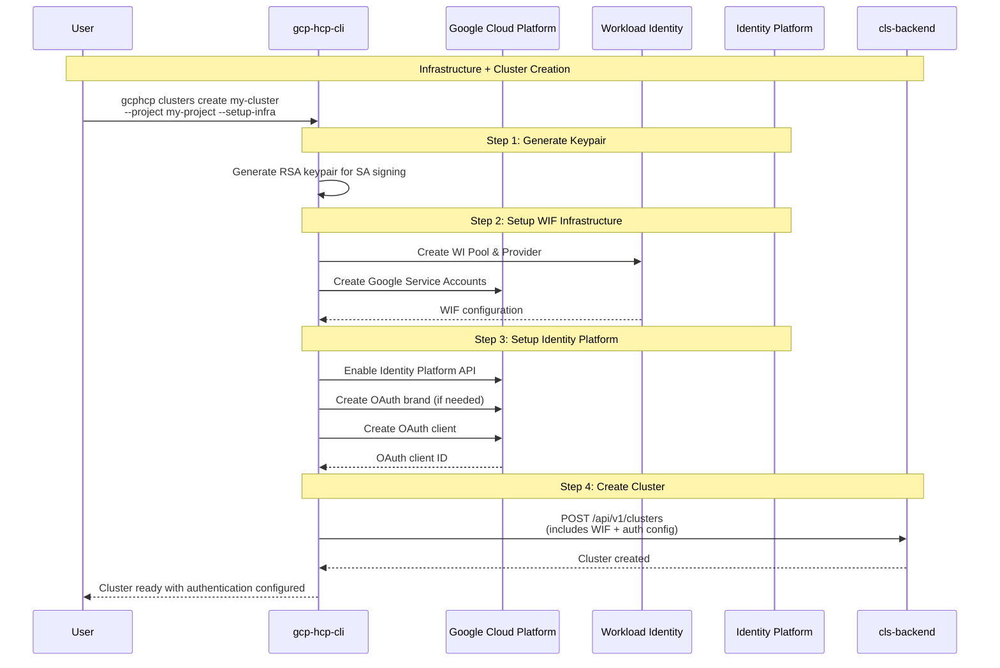
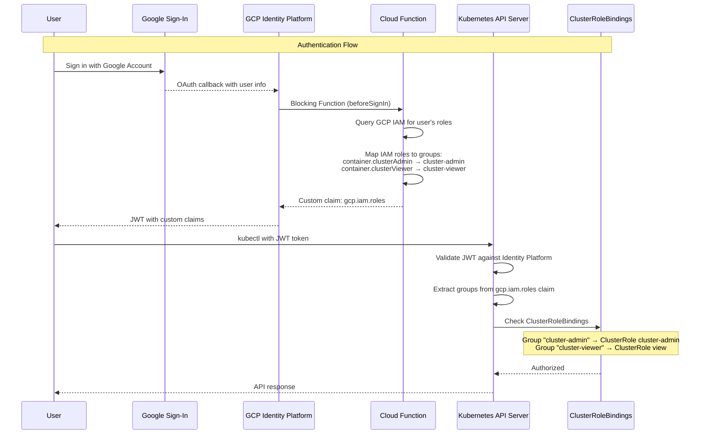
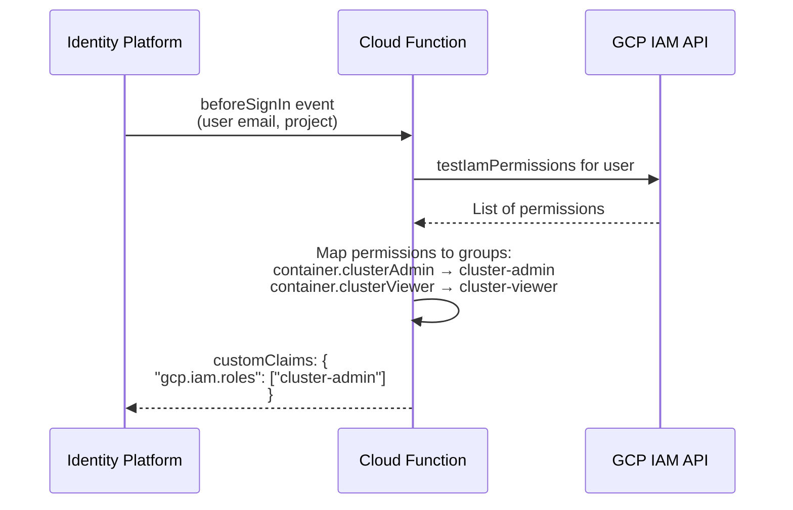

# GCP Hosted Clusters Customer Authentication Design

## Overview

This document outlines the design for customer authentication on GCP-HCP hosted clusters using GCP Identity Platform as the OIDC issuer. The approach uses HyperShift's External OIDC feature to configure the Kubernetes API Server to authenticate users via Google accounts, with IAM role-based access control mapping to Kubernetes RBAC.

**Key Design Decisions:**
- Use External OIDC (configures KAS directly, not OpenShift OAuth server)
- Use GCP Identity Platform as the OIDC issuer (mandatory for all clusters)
- OAuth client auto-created during infrastructure setup (no manual configuration)
- Google authentication only (kubeadmin removed)
- `roles/container.clusterAdmin` → `cluster-admin` ClusterRole
- `roles/container.clusterViewer` → `view` ClusterRole

## Infrastructure Setup for Provisioning GCP Identity Platform as the OIDC Issuer

The authentication infrastructure is provisioned automatically as part of WIF infrastructure setup:



## GCP Identity Platform Configuration

### OAuth Client Creation

The CLI automatically provisions the OAuth client during infrastructure setup:

```bash
# Enable Identity Platform API
gcloud services enable identitytoolkit.googleapis.com --project PROJECT_ID

# Create OAuth brand (one per project)
gcloud iap oauth-brands create \
  --application_title="GCP HCP Cluster Auth" \
  --support_email="USER_EMAIL" \
  --project PROJECT_ID

# Create OAuth client
gcloud iap oauth-clients create BRAND_NAME \
  --display_name="GCP-HCP-Cluster-Auth"
```

## HyperShift External OIDC Configuration

The cluster spec includes External OIDC authentication configuration:

```json
{
  "spec": {
    "authentication": {
      "type": "OIDC",
      "oidcProviders": [{
        "name": "gcp-identity-platform",
        "issuerURL": "https://securetoken.google.com/PROJECT_ID",
        "audiences": ["OAUTH_CLIENT_ID"],
        "clientID": "OAUTH_CLIENT_ID",
        "claimMappings": {
          "usernameClaim": "email",
          "groupsClaim": "gcp.iam.roles"
        }
      }]
    }
  }
}
```

This translates to the HyperShift HostedCluster API:

```yaml
apiVersion: hypershift.openshift.io/v1beta1
kind: HostedCluster
metadata:
  name: my-cluster
spec:
  configuration:
    authentication:
      type: OIDC
      oidcProviders:
        - name: gcp-identity-platform
          issuer:
            issuerURL: https://securetoken.google.com/PROJECT_ID
            audiences:
              - OAUTH_CLIENT_ID
          claimMappings:
            username:
              claim: email
            groups:
              claim: gcp.iam.roles
```

## Implementation Plan for GCP Identity Platform Provisioning

### Phase 1: CLS-Backend Model Updates

1. Add `AuthenticationSpec` types to `internal/models/cluster.go`
2. Create `internal/services/auth_defaults.go` for default GCP auth config
3. Update cluster service to validate authentication configuration

**Required API Extensions:**

```go
// AuthenticationSpec represents External OIDC authentication configuration
type AuthenticationSpec struct {
    Type          string             `json:"type,omitempty"`
    OIDCProviders []OIDCProviderSpec `json:"oidcProviders,omitempty"`
}

type OIDCProviderSpec struct {
    Name          string             `json:"name"`
    IssuerURL     string             `json:"issuerURL"`
    Audiences     []string           `json:"audiences"`
    ClientID      string             `json:"clientID"`
    ClaimMappings *ClaimMappingsSpec `json:"claimMappings,omitempty"`
}

type ClaimMappingsSpec struct {
    UsernameClaim string `json:"usernameClaim,omitempty"`
    GroupsClaim   string `json:"groupsClaim,omitempty"`
}
```

### Phase 2: GCP-HCP-CLI Updates

Builds on [PR #5](https://github.com/apahim/gcp-hcp-cli/pull/5) which adds WIF infrastructure provisioning.

1. Create `src/gcphcp/utils/identity_platform.py` - Identity Platform setup utility
2. Update `WIFSetupResult` to include `oauth_client_id`
3. Update `_setup_wif_automatic()` to include Identity Platform setup
4. Update `_build_cluster_spec()` to include authentication config
5. Update `gcphcp infra create` to include OAuth client in output


#### CLI Usage

```bash
# Create cluster with automatic infrastructure setup
# (WIF + Identity Platform OAuth client are auto-provisioned)
gcphcp clusters create my-cluster \
  --project my-gcp-project \
  --setup-infra

# Create infrastructure separately, then create cluster
gcphcp infra create my-infra --project my-gcp-project
# Creates: my-infra-signing-key.pem, my-infra-jwks.json, my-infra-iam-config.json
# (iam-config.json includes auto-generated oauthClientId)

gcphcp clusters create my-cluster \
  --project my-gcp-project \
  --iam-config-file my-infra-iam-config.json \
  --signing-key-file my-infra-signing-key.pem
```

#### Sample IAM Config Output with oauth configuration

```json
{
  "projectId": "my-gcp-project",
  "projectNumber": "123456789012",
  "infraId": "my-cluster",
  "workloadIdentityPool": {
    "poolId": "my-cluster-wi-pool",
    "providerId": "my-cluster-k8s-provider"
  },
  "serviceAccounts": {
    "ctrlplane-op": "my-cluster-ctrlplane@my-project.iam.gserviceaccount.com",
    "nodepool-mgmt": "my-cluster-nodepool@my-project.iam.gserviceaccount.com"
  },
  **"oauthClientId": "123456789.apps.googleusercontent.com"**
}
```


## Authorization: GCP IAM Roles to Kubernetes RBAC Mapping

### Phase 3 

The goal of this phase is mapping GCP IAM roles to Kubernetes ClusterRoleBindings, enabling IAM-based access control for hosted clusters. 

**Note:** One possible approach under consideration for injecting IAM role information into tokens is using a Cloud Function for Custom Claims (see Appendix below).


### IAM Role Mapping

| GCP IAM Role | Custom Claim Group | Kubernetes ClusterRole |
|--------------|-------------------|----------------------|
| `roles/container.clusterAdmin` | `cluster-admin` | `cluster-admin` |
| `roles/container.clusterViewer` | `cluster-viewer` | `view` |

## RBAC Configuration

ClusterRoleBindings are created to map Identity Platform groups to Kubernetes roles:

```yaml
apiVersion: rbac.authorization.k8s.io/v1
kind: ClusterRoleBinding
metadata:
  name: gcp-cluster-admin
roleRef:
  apiGroup: rbac.authorization.k8s.io
  kind: ClusterRole
  name: cluster-admin
subjects:
  - apiGroup: rbac.authorization.k8s.io
    kind: Group
    name: cluster-admin
---
apiVersion: rbac.authorization.k8s.io/v1
kind: ClusterRoleBinding
metadata:
  name: gcp-cluster-viewer
roleRef:
  apiGroup: rbac.authorization.k8s.io
  kind: ClusterRole
  name: view
subjects:
  - apiGroup: rbac.authorization.k8s.io
    kind: Group
    name: cluster-viewer
```

## Appendix: Proposed Authentication Approach

The following sections describe a proposed end-to-end authorization flow that uses a Cloud Function to inject IAM role information into tokens. This approach is under consideration.

### End-to-End Authentication Flow

The following sequence diagram shows how a user would authenticate to a GCP-HCP hosted cluster:



### Cloud Function for Custom Claims

A blocking function would run before each sign-in to inject IAM role information:




## Prerequisites

1. **ExternalOIDC Feature Gate**: Must be enabled on management cluster HyperShift operator
2. **GCP Permissions**: User must have permissions to:
   - Create OAuth brands and clients (`clientauthconfig.*`)
   - Enable APIs (`serviceusage.services.enable`)
   - Deploy Cloud Functions (`cloudfunctions.*`)
3. **GCP APIs**: Automatically enabled by CLI:
   - `identitytoolkit.googleapis.com` (Identity Platform)
   - `cloudfunctions.googleapis.com` (Cloud Functions)

## Risks & Considerations

1. **IAM Role Propagation Delay**: Changes to IAM roles are not immediately reflected in tokens - users must re-authenticate
2. **Cloud Function Cold Starts**: First authentication may be slow; consider minimum instances for production
3. **No Fallback Access**: With kubeadmin removed, ensure break-glass procedure is documented
4. **Token Lifetime**: GCP Identity Platform tokens have 1-hour lifetime; clients must implement token refresh
5. **One OAuth Brand Per Project**: GCP limits to one OAuth brand per project; shared across all clusters in project

## Future Enhancements

1. Support for additional IAM roles beyond clusterAdmin/clusterViewer
2. Custom role mapping configuration per cluster
3. Integration with GCP Audit Logging for authentication events
4. Support for service account authentication (non-human users)

## References

### OpenShift/ROSA Documentation

- [Creating a ROSA with HCP cluster using external OIDC](https://docs.redhat.com/en/documentation/red_hat_openshift_service_on_aws/4/html/install_rosa_with_hcp_clusters/rosa-hcp-sts-creating-a-cluster-ext-auth) - Official ROSA HCP external authentication setup guide
- [Enabling direct authentication with an external OIDC identity provider (OCP 4.19)](https://docs.redhat.com/en/documentation/openshift_container_platform/4.19/html/authentication_and_authorization/external-auth) - OpenShift Container Platform external auth documentation
- [Simplify access to your ROSA clusters using external OIDC](https://developers.redhat.com/articles/2024/07/08/simplify-access-your-rosa-clusters-using-external-oidc) - Red Hat Developer article on external OIDC benefits

### HyperShift

- [HyperShift Documentation](https://hypershift-docs.netlify.app/) - Official HyperShift documentation
- [External OIDC enablement PR #3261](https://github.com/openshift/hypershift/pull/3261) - Original HyperShift external OIDC implementation

### Internal Design Documents

- OCM-DDR-53: External OIDC - OCM design decision record for External OIDC
- OCM-DDR-54: Admin Access for External OIDC - OCM design decision record for admin access
- External OIDC Configuration for HCP Notes - Implementation notes for HCP external OIDC
- Adobe Auth Solution Discussion - Customer-specific authentication solution discussion
