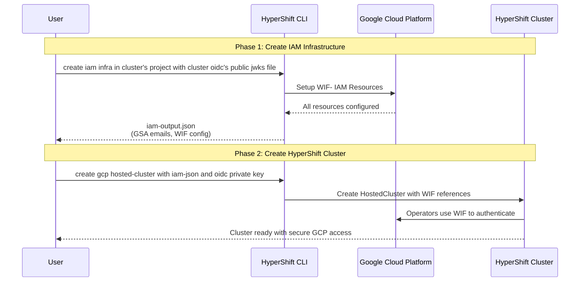
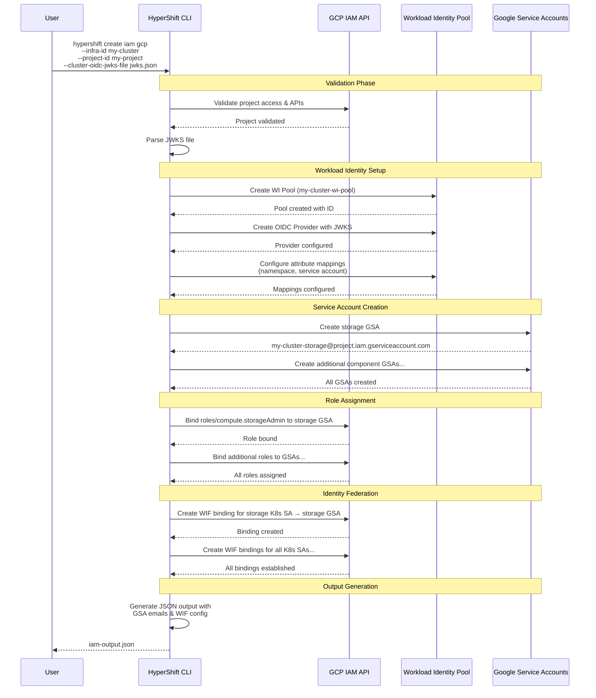
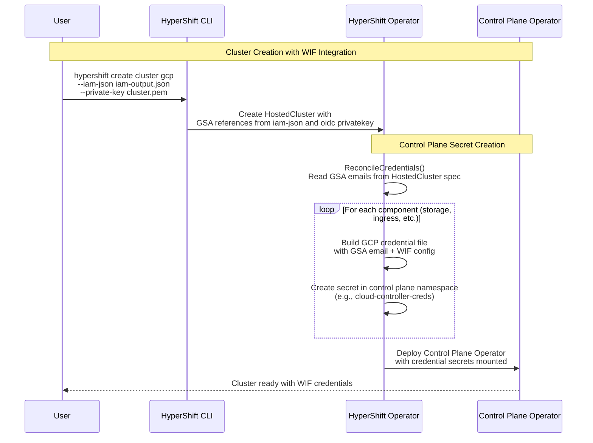
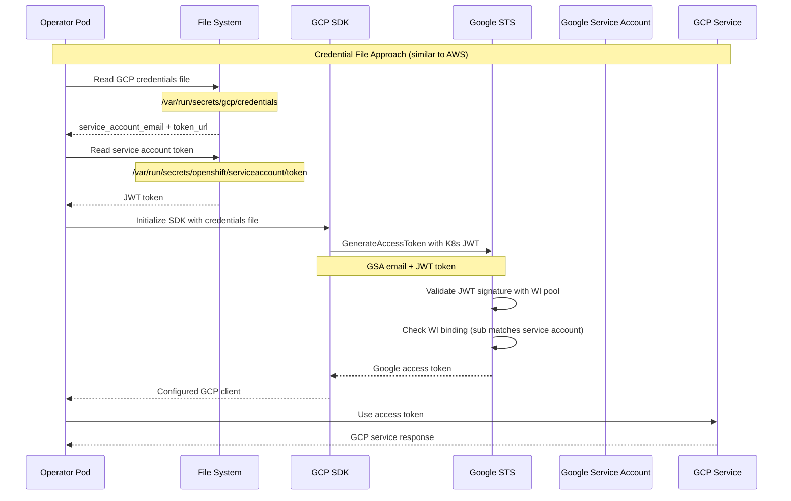

# GCP Hosted Clusters WIF Integration Design

## Overview

This document outlines the design of the GCP Workload Identity Federation (WIF) workflow for HyperShift GCP Hosted Clusters. The approach removes the need for long-lived service account keys by using credential files that reference Google Service Accounts and Kubernetes service account tokens.

## End-to-End User Workflow

The following sequence diagram shows how a user creates GCP IAM infrastructure and then uses it to create a HyperShift cluster:




## GCP IAM Infrastructure Creation
The HyperShift CLI will be extended to include a command that provisions the required GCP IAM infrastructure for a HyperShift cluster.

#### Command Structure

```bash
hypershift create iam gcp [flags]
```

#### Required Arguments

| Flag | Description | GCP Specifics |
|------|-------------|---------------|
| `--infra-id` | Cluster infrastructure identifier | Used as prefix for WI pool, provider, and GSA names |
| `--project-id` | GCP Project ID where resources will be created | Must have required APIs enabled |
| `--cluster-oidc-jwks-file` | Path to a local JSON file containing OIDC provider's public key in JWKS format | Required for configuring the Workload Identity Provider |

#### Optional Arguments

| Flag | Default | Description | GCP Specifics |
|------|---------|-------------|---------------|
| `--additional-labels` | none | Additional labels for created resources | GCP resource labeling for organization |
| `--output-file` | stdout | Path to output JSON file with GSA details | Contains GSA emails and WIF configuration |


#### Overview of operations 
The following sequence diagram shows the detailed interactions during `hypershift create iam gcp` execution:



##### sample out Format

```json
{
  "projectId": "my-gcp-project",
  "projectNumber": "123456789012",
  "infraId": "my-cluster",
  "workloadIdentityPool": {
    "poolId": "my-cluster-wi-pool",
    "providerId": "my-cluster-k8s-provider",
    "audience": "//iam.googleapis.com/projects/123456789012/locations/global/workloadIdentityPools/my-cluster-wi-pool/providers/my-cluster-k8s-provider"
  },
  "serviceAccounts": {
    "storageGSA": "my-cluster-storage-hypershift@my-gcp-project.iam.gserviceaccount.com",
    "cloudControllerGSA": "my-cluster-cloud-controller-hypershift@my-gcp-project.iam.gserviceaccount.com",
    "nodePoolManagementGSA": "my-cluster-node-pool-hypershift@my-gcp-project.iam.gserviceaccount.com",
    "controlPlaneOperatorGSA": "my-cluster-control-plane-hypershift@my-gcp-project.iam.gserviceaccount.com",
    ...
    ...
  }
}
```

##### Notes
- WIF pool provider is configured with the specified jwks file, making the issuer url  irrelevant
- Google Service Accounts are created as needed for each cluster component/operator that needs to access GCP APIs
- GSA will be applied this naming convention: `{infra-id}-{component}@{project}.iam.gserviceaccount.com`
- To start with, pre-defined admin level roles will be to GSA, this will enhanced to granular roles and permissions in later phases


## WIF Integration during Cluster Creation

During HyperShift GCP cluster creation, the previously created IAM infrastructure (Workload Identity Pool, Google Service Accounts, and WIF bindings) is integrated into the cluster to enable keyless authentication for all cluster components.

The cluster creation process requires two key inputs from the IAM infrastructure setup:

1. **IAM Output JSON**: Contains Google Service Account emails and Workload Identity configuration created by `hypershift create iam gcp`
2. **OIDC Private Key**: The private key corresponding to the public JWKS file used during IAM infrastructure creation

**Key Integration Steps:**

1. **OIDC Configuration**: The HostedCluster specification includes reference to the oidc private key  (provided via `HostedCluster.spec.serviceAccountSigningKey`). The cluster is configured with this private key to sign service account JWT tokens.
2. **Credential Reference**: The HostedCluster specification also includes references to the Google Service Account emails created during IAM infrastructure setup
3. **Credential File Generation**: For each cluster component (storage, ingress, etc.), the operator generates GCP credential files that combine the GSA email with Workload Identity Federation configuration  
4. **Secret Creation**: These credential files are stored as Kubernetes secrets in the control plane namespace, making them available to cluster operators
5. **Automatic Authentication**: Once deployed, cluster operators automatically authenticate to GCP using their mounted credential files and OIDC-signed service account tokens, without requiring any long-lived keys


The following sequence diagram shows the WIF integration flow during cluster creation:




### GCP Credentials File Format 

Instead of AWS credential files, use GCP service account credential files that reference WIF:

```json
{
  "type": "external_account",
  "audience": "//iam.googleapis.com/projects/PROJECT_NUMBER/locations/global/workloadIdentityPools/POOL_ID/providers/PROVIDER_ID",
  "subject_token_type": "urn:ietf:params:oauth:token-type:jwt",
  "token_url": "https://sts.googleapis.com/v1/token",
  "service_account_impersonation_url": "https://iamcredentials.googleapis.com/v1/projects/-/serviceAccounts/SERVICE_ACCOUNT_EMAIL:generateAccessToken",
  "credential_source": {
    "file": "/var/run/secrets/openshift/serviceaccount/token"
  }
}
```


### The Authentication Flow :

Behind the scenes, GCP Workload Identity Federation authentication involves several cryptographic and infrastructure components that work together to establish secure, keyless access:

1. **Credential File** (not SA) contains the actual cloud identity (GSA email)
2. **Service Account Token** is mounted as a separate file 
3. **GCP SDK reads both files** and combines them for authentication
4. **Trust relationship validates** that the token subject matches expected identity
5. **Cloud permissions come from the GSA**, not the Kubernetes service account


**OIDC Key Pair Role:**
- **Public Key (JWKS)**: Used during IAM infrastructure creation to configure the Workload Identity Provider to trust tokens signed by the cluster
- **Private Key**: Used during cluster creation to sign service account tokens that will be validated against the public key stored in the WIF provider
- **Trust Chain**: This establishes the cryptographic trust relationship where GCP can validate that tokens presented by cluster operators were indeed issued by the authorized cluster

The following sequence diagram shows in‑pod GCP authentication via WIF using a credential file:




## Implementation Plan

### Phase 1: 
1. Implement `cmd/infra/gcp/create_iam.go` - Workload Identity pool and GSA creation
2. Implement `hypershift-operator/controllers/hostedcluster/internal/platform/gcp/gcp.go` - Credential management 
3. Extend `api/hypershift/v1beta1/gcp.go` - Add RolesRef struct for WIF/GSA
4. Extend `cmd/cluster/gcp/create.go` - Cluster creation with GCP to include RolesRef
5. Implement `cmd/infra/gcp/destroy_iam.go` - Cleanup process
6. Add comprehensive testing for each of the above

### Phase 2: Future
1. Assign minimal/granular permissions to roles
2. Add support for shared VPC 


### Required API Extensions

Extend `GCPPlatformSpec` to include GSA references (similar to AWS `AWSRolesRef`):

```go
// Planned extension to api/hypershift/v1beta1/gcp.go
type GCPPlatformSpec struct {
    Project string `json:"project"`
    Region  string `json:"region"`
    
    // rolesRef contains references to Google Service Accounts 
    // created by the infrastructure setup.
    // +optional
    RolesRef GCPRolesRef `json:"rolesRef,omitempty"`
}

type GCPRolesRef struct {
    
    // storageGSA is the email of the Google Service Account for storage operations  
    StorageGSA string `json:"storageGSA"`
    
    // nodePoolManagementGSA is the email of the Google Service Account for node pool management
    NodePoolManagementGSA string `json:"nodePoolManagementGSA"`
    
    // controlPlaneOperatorGSA is the email of the Google Service Account for control plane operator
    ControlPlaneOperatorGSA string `json:"controlPlaneOperatorGSA"`
    
    ...
    ...
}
```


## Cleanup Process

The planned cleanup process would systematically remove all GCP IAM resources:

## GCP IAM Infrastructure Destruction

The HyperShift CLI will also include a command to cleanly remove all GCP IAM infrastructure created for a cluster.

#### Command Structure

```bash
hypershift destroy iam gcp [flags]
```

#### Required Arguments

| Flag | Description | GCP Specifics |
|------|-------------|---------------|
| `--infra-id` | Cluster infrastructure identifier | Used to identify resources to destroy |
| `--project-id` | GCP Project ID where resources exist | Must match the project used during creation |

#### Optional Arguments

| Flag | Default | Description | GCP Specifics |
|------|---------|-------------|---------------|
| `--dry-run` | `false` | Show what would be destroyed without actually deleting | Safety feature for validation |


#### Safety Features

- **Resource validation**: Verifies resources belong to the specified cluster before deletion
- **Dry-run mode**: Shows what would be deleted without performing actual operations
- **Error handling**: Continues cleanup even if some resources are already deleted
- **Confirmation prompts**: Optional interactive confirmation for destructive operations


